# Building the App Devlog Phase 1

(November 13-25)

#### It Includes:

- Sprint 1 → Sprint 8

- Feature building

- Architecture progression

- Maps, Community, Events, Auth, Role systems, etc.

---

# Sprint #1 Foundations and Events

(Nov 13)

### Sprint Goals #1 Foundations and Events

1. Initialize the Expo project and set up the folder structure
2. Install React Navigation + Bottom Tab Navigator
3. Create placeholder screens for: Hub, Map, Community, Account
4. Add tri-town filter tabs (Banff, Canmore, Lake Louise)
5. Design the first Event Card component
6. Build static HubScreen with mock event data
7. Add category filter chips

---

### Challenges + How I Solved Them

<b>Issue: Confusion between the app folder and the backend server folder</b>

I originally mixed backend and frontend files together, which caused confusion about which commands belonged to which part of the stack.

<b>Fix:</b>

I restructured the project so the React Native app and Node/Express backend live in separate folders:

- /server → backend API (run with node server/index.js)
- Expo project → mobile app (run with npx expo start)
  This instantly made the workflow cleaner and more professional.

---

<b> Issue: Started with Expo Router + TSX too early</b>

I jumped into Expo Router and TypeScript without being fully comfortable with them.

<b>Fix:</b>

I rolled back to a simpler setup using React Native + JavaScript and standard navigation. This made the project easier to build and debug and removed unnecessary complexity for Sprint 1.

---

### Wins + Breakthroughs

- Sprint 1 ran extremely smoothly — completed everything in a single day

- I now understand mobile-first folder structure for React Native much better

- Building static UI with mock events early helped me visualize the final “hub feed” design
- I quickly established the overall layout of the app, which made future sprints faster

### What I Learned

- Keep UI simple during the foundation stage — focus on structure, not perfection

- Install core dependencies early (navigation, safe-area, gesture handler)

- Mocking events before creating the backend helps clarify data shapes and user flows
- Keeping Expo and the server completely separate makes development smoother

---

### Photos of Sprint 1 Progress

#### Trello Sprint Baord

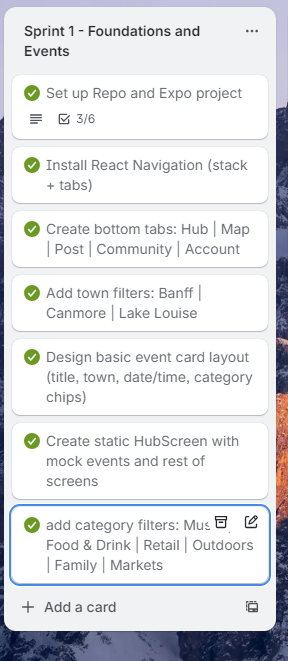

#### Github Commits

#### Screens (Hub, Map, Add Event, Community, Account)

## Sprint #2 Backend and Events API

( November 14th)

### Sprint Goals #2 - Backend and Events API

1. Set up Node + Express + Mongodb
2. Connect backend to MongoDB Atlas
3. Define the Event model
   - title, description, town, category
   - date, time, location
   - latitude/longitude
   - imageUrl
4. Seed example events for Banff/Canmore/Lake Louise
5. Implement full CRUD (Create, Read, Update, Delete)
6. Connect HubScreen to backend (fetch events)
7. Add loading & error states
8. Filter events by town
9. Create full Event Detail Screen
10. Add pull-to-refresh behavior

---

### Challenges + How I Solved Them

<b>Issue: MongoDB “bad auth” authentication error</b>

I initially couldn’t connect to the database because of a credential mismatch and IP access restrictions.

<b>Fix:</b>

- Updated .env with correct connection string
- Ensured database user permissions were correct
- Enabled IP Access: 0.0.0.0/0
- Successfully connected after rewriting connection code in ESM format

  After these changes, the server successfully connected to MongoDB Atlas.

---

<b>Issue: HubScreen.js ballooned to 400+ lines</b>

The Hub feed was doing too much inside a single file (fetching, filtering, rendering, and UI layout).

<b>Fix:</b>
Refactored into smaller components:

- EventCard.js
- TownChips.js
- CategoryChips.js

This improved readability, maintainability, and overall organization.

---

<b>Issue: EventDetails was mistakenly added as a Tab</b>

The details page temporarily appeared as a bottom-tab icon, which broke UX.

<b>Fix:</b>

Moved EventDetailScreen into a Stack Navigator instead of the tab bar.
Tabs now handle main navigation; details are pushed on top.
Navigation behavior is now correct and professional.

---

<b>Issue: Pull-to-refresh spinner appeared black in Expo Go</b>

The native spinner ignored color props in Expo Go, causing visibility issues on dark UI.

<b>Fix:</b>

Native spinner ignored color props → created my own custom white spinner overlay for a consistent experience and added a small minimum delay for smoother UX.

---

### Wins + Breakthroughs

- First successful API call from Expo app → Node/Express backend

- Real MongoDB events displayed in the Hub feed

- Combined live API data + mock data for seamless local development

- Hub → Event Details navigation now fully polished

- App runs smoothly on Expo Go over LAN

- Started formal API documentation

- Built a polished Event Detail screen with hero image + scroll layout

This sprint marked the moment the app officially became a full-stack project.

---

### What I Learned This Week

- How to connect Express to a MongoDB Atlas database securely

- How to test endpoints in Thunder Client and verify CRUD functionality

- A much deeper understanding of structuring:

  - App.js
  - TabNavigator
  - RootNavigator
  - and how stacks + tabs work together

- Better error handling around network requests and fallback mock data

- How to improve UI performance with loading states + pull-to-refresh

---

#### Photos of Progress - Sprint 2

##### Trello Sprint

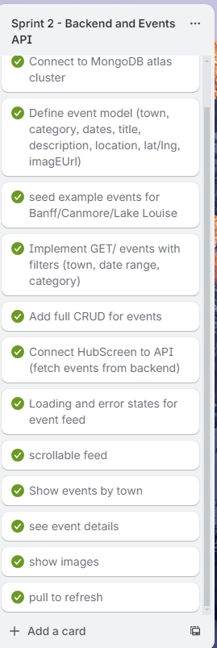

##### MongoDB Connected Successfully

"Connected to Mongo as of Nov 14th"

##### Github Commits

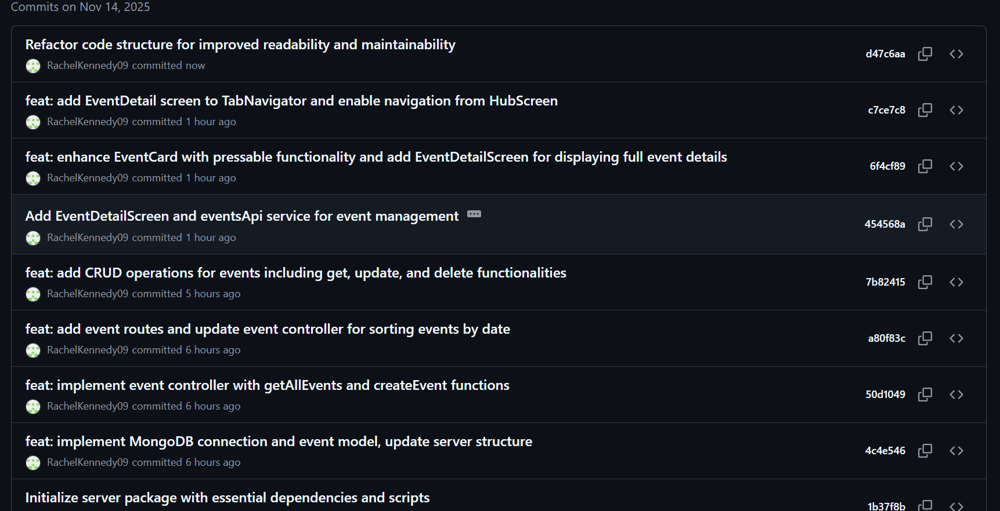

##### CRUD Thunderclient

POST

GET ALL

GET BY ID

UPDATE

DELETE

---

## Sprint #3

(November 16th-17th)

### Sprint Goals

1. Build full backend authentication (JWT + bcrypt)
2. Create User model (name, email, password, role, timestamps)
3. Implement /auth/register, /auth/login, /auth/me
4. Add middleware for protected routes
5. Connect frontend Login + Register screens
6. Add persistent sessions using secure token storage
7. Build Account screen with real user data
8. Handle token expiry and auto-logout
9. Fix registration + login errors
10. Add backend route protections (only event owners can update/delete)

---

### Challenges + How I Solved Them

<b>Issue: Accidentally pushed .env to GitHub</b>

This exposed the MongoDB URI and JWT secret.

<b>Fix:</b>

- immediately removed .env from Git history

- Added .env to .gitignore

- Re-created the MongoDB cluster + new credentials

- Confirmed everything was protected and secure

---

<b>Issue: “Network request failed” after adding AuthStack + AppStack </b>

The app stopped communicating with the server.

<b>Fix:</b>

Found the issue was just a small typo in the API URL.
Corrected it — everything worked instantly.

---

<b>Issue: Backend wasn’t receiving JSON properly</b>

Requests were not formatted correctly.

<b>Fix:</b>

- Added server-side debug logs

- Confirmed express.json() was working

- Verified client-side request body formatting

- Removed temporary logs once fixed

---

<b>Issue: Token validation inconsistency </b>

Some requests weren’t sending the token correctly.

<b>Fix:</b>

- Standardized the Authorization header

- Added fallback checks

- Confirmed /auth/me works in all cases

---

### Wins + Breakthroughs

- Successfully implemented full JWT authentication

- Added register, login, logout, and auto-login

- AuthContext now manages:

  - token storage

  - restoring sessions

  - updating UI based on login state

- Connected backend auth to frontend screens

- AccountScreen now displays real user data

- Protecting event routes so only logged-in creators can modify their posts

- Gained a deep understanding of:

  - token lifecycles

  - /auth/me route

  - expired token behavior

  - secure middleware patterns

This sprint transformed SummitScene into a secure, authenticated full-stack mobile app.

### What I Learned This Week

- Security requires discipline — every step matters

- Error messages should not leak internal logic for safety

- Chose 24-hour token expiration instead of 7 days or 15 minutes:

  - More realistic for a production app

  - Secure but not annoying

  - Easier for grading during the project

- Properly protecting routes is essential for business logic

- Much deeper understanding of how auth middleware works in Express

#### Photos of Progress - Sprint 3

Github Commits - Nov 16

Finished LoginScreen, RegisterScreen, AuthContext, User model, and initial auth routes

#### Thunder Client: /auth/login

#### Thunder Client: /auth/register

GitHub Commits — Nov 17

AuthStack + AppStack, token persistence, Account screen

---

## Sprint #4 Post Event Form & Real Events Feed

(November 18-19)

### Sprint Goals

1. Build Post Event form UI
2. Connect the form to the backend POST /api/events route
3. Display success and error mesasge
4. Add loading and submitting states
5. Add validation (date, category, town, title, etc.)
6. Add pull-to-refresh for My Events
7. Clean up UI and improve form UX
8. Hook HubScreen to real backend data instead of mock events

---

### Challenges + How I Solved Them

<b>Issue: Login/Register fields not typing on Web (Pressable conflict)</b>

On the web version, all text inputs inside <Pressable> stopped responding and I couldn’t type at all.

<b>Fix:</b>

Since this sprint focused on mobile-first functionality, I deferred Web debugging to the end of the Capstone. Expo Go mobile continues to be the priority.

---

<b>Issue: Date Picker showed wrong date (one day ahead)</b>

React Native’s DateTimePicker was returning UTC-converted dates, causing the displayed date to shift ahead by one day.

<b>Fix:</b>

Switched to manual formatting:

- Extracted year/month/day directly from the Date object

- Avoided .toISOString()
  This ensures accurate local timezone dates on all devices.

---

<b>Issue: iOS “pill” compact picker UI was confusing</b>

The default iOS picker uses a compact “pill” display, requiring two taps (pill → full calendar). The UI felt clunky and unclear.

<b>Fix:</b>

I explicitly set

- display="inline" for calendar on iOS

- display="spinner" for time on iOS

- and native calendar/clock modes on Android
- This made the date/time picker open instantly when the input is pressed.

---

<b>Issue: Default Picker dropdowns looked inconsistent </b>

The default Picker component UI didn’t match the rest of the app’s design.

<b>Fix:</b>

Replaced Pickers with custom modal dropdowns for Town and Category.
These now match the rest of the app and provide a smooth, branded feel.

---

<b>Issue: Understanding the full Post Event flow (frontend → backend → DB)</b>

This was my first time wiring a complete feature from UI → API → database.

<b>Fix:</b>

I broke down the flow step-by-step:

- App sends POST /api/events with the JWT token

- Backend middleware verifies the token

- Controller creates a new Event in MongoDB

- Newly saved Event returns to the client
  This helped solidify my understanding of full-stack communication.

---

### Wins + Breakthroughs

- Built a fully functional Post Event form

- Created custom dropdown menus that fit the SummitScene design

- Eliminated timezone issues with accurate local date/time picking

- Cleaned and simplified the form UX to reduce user errors

- Understood backend validation and how controllers process event data

- Wired HubScreen to show only real events from MongoDB

- Successfully connected mobile → backend → database in a full loop

### What I Learned This Week

- How to build polished mobile dropdowns using:

  - @react-native-community/datetimepicker
  - Modal
  - Custom Pressable dropdown selectors

- How authenticated fetch requests work with JWT tokens

- How important UX consistency is, especially for forms

- How to coordinate frontend + backend changes during feature development

- How to avoid design conflicts between web and mobile by focusing on mobile-first flow

### Photos of Progress - Sprint 4

#### November 18th - Event Posting Success

Console-log of event posted

MongoDB event created successfully

Github Commit (Nov 18)

---

#### November 19th - Hooking HubScreen to Real Events

Trello Card completed:

Github commit (Nov 19)
(Wired HubScreen to only real backend events)

---

## Sprint #5 - Role0Based Accounts & Business Features

(November 20-21)

### Sprint Goals

1. Add role-based accounts (“local” vs “business”) during registration
2. Add role-safe JWT creation & backend enforcement
3. Add role-based navigation (hide “Post Event” tab for local users)
4. Build My Events screen showing only events created by the logged-in business
5. Add business-only create event route + middleware (isBusiness)
6. Add business-only update/delete routes with ownership checks
7. Add EditEventScreen + navigation from My Events
8. Add Upgrade Account feature (local → busines)
9. Add redirect: posting an event sends user to My Events
10. Improve UX for business users (“View My Events” button in Account screen)

---

### Challenges + How I Solved Them

<b>Issue: Business token returned “Invalid or expired token” when posting events </b>

Thunder Client refused the POST request, even with valid credentials.

<b>Fix:</b>

Restarted server & refreshed token. Retrieved a new JWT from /auth/login, then placed it correctly in Thunderclienta Authorization: Bearer <token> header.

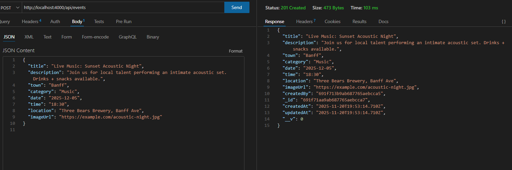

---

<b>Issue: Missing role in JWT caused navigation crashes</b>

Older accounts had tokens without role, which broke navigation logic.

<b>Fix:</b>

- Updated createToken() to embed { userId, role }
- added fallback for old accounts
- and ensured AuthContext stores user.role safely.

---

<b>Issue: Business-only “Post” tab wasn’t appearing </b>

Tabs did not update based on the user’s role.

<b>Fix:</b>

Added: const isBusiness = user?.role === "business"

Then conditionally rendered the Post tab inside TabNavigator.
Verified via /auth/me that role was flowing correctly.

---

<b>Issue: Older events that I had created before business vs local logic were not update</b>

These events didn’t contain business-owner fields, so they didn’t appear correctly.

<b>Fix:</b>

Deleted old events and recreated new ones under the updated logic.
Everything displayed perfectly afterward.

---

### Wins + Breakthroughs

- Added full role-based authentication (local vs business)
- App now conditionally shows business-only features
- Created a complete upgrade account system (local → business)
- Finished My Events with owner-only event list
- Fully working update + delete backend routes with ownership enforcement
- Cleaned up /auth/register, /auth/login, and /auth/me to include roles
- Added post-event redirect for better UX
- Account screen now shows role-aware UI

### What I Learned This Sprint

- How to build role-based systems using JWT

- How to secure API routes for different account types

- How to create business-specific screens (My Events, Edit, Delete flows)

- How to build smooth UX for creators (redirects, alerts, buttons)

- How to manage large React Native forms and screens cleanly

### Photos of Progress - Sprint 5

#### November 20th - role Creation + Business Logic

Successful POST /auth/register with role field

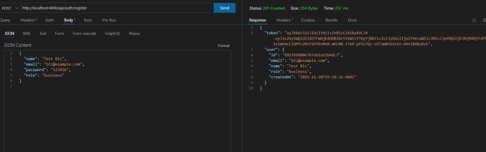

successful POST as Business role

successful create local user

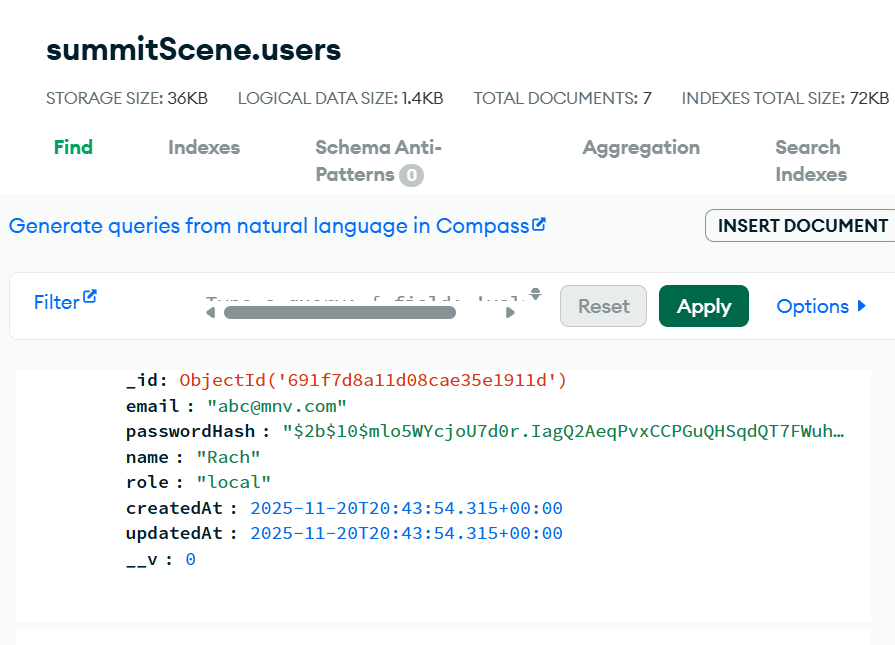

successful business role in MONGODB

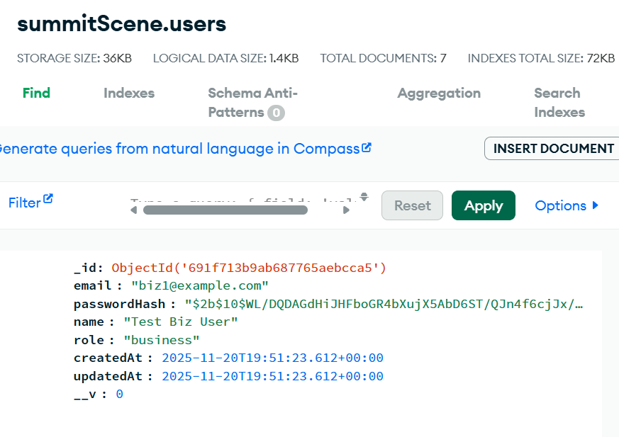

#### App Screens — New Business Flow

New “View My Events” button in Account screen

New My Events screen

Git commit

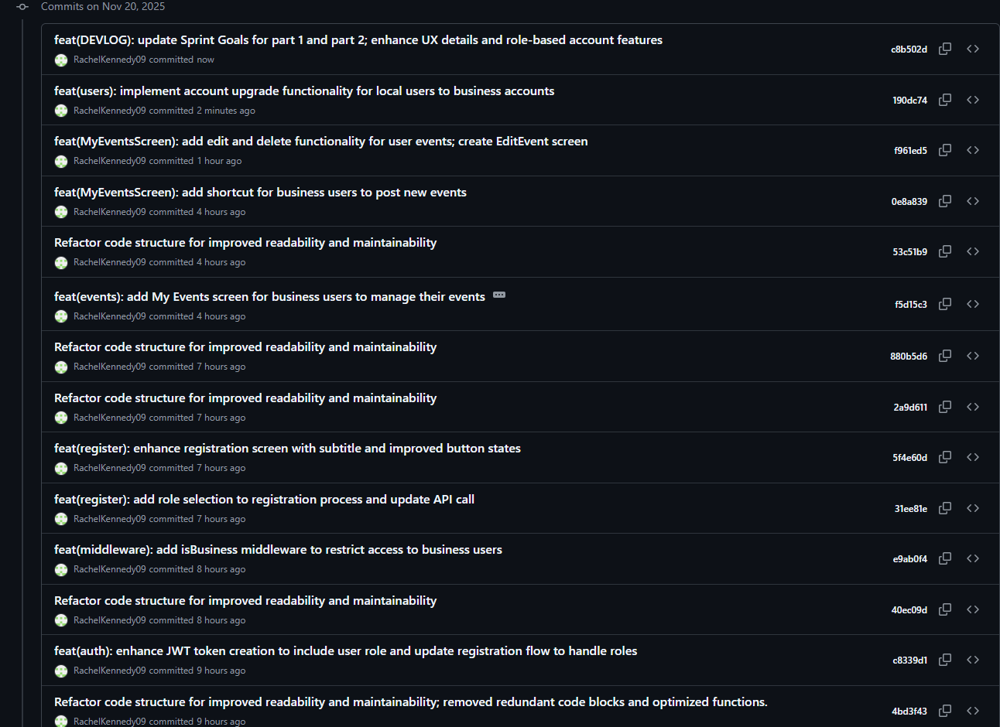

Sprint 5 done

---

## Sprint #6 - Community Screens/Tabs

(Nov 23-24)

### Sprint Goals

1. Design CommunityPost model + routes
2. Create protected /api/community GET + POST
3. Build CommunityScreen with boards:
   - Highway/Weather Conditions
   - Rideshare / Carpool
   - Event Buddies (new to town?)
4. Build CreateCommunityPostScreen with full form + validation
5. Add loading, error, and empty states
6. Replace all mock data with real API fetches
7. Add targetDate for posts
8. Add Edit/Delete for post creators
9. Community StackNavigator for a deeper screen

---

### Challenges + How I Solved Them

<b>Issue: DateTimePicker caused Expo to crash instantly</b>

Tapping the picker caused an immediate crash on some devices.

<b>Fix:</b>

Used platform-safe picker config:

- Android → display="calendar"
- iOS → display="spinner"
  Also ensured targetDate defaults to new Date() and removed the conflicting TextInput wrapper.

---

<b>Issue: Posts wouldn’t refresh after submitting</b>

<b>Fix:</b>

Implemented useFocusEffect + fetchPosts() to auto-refresh every time the screen becomes active.

---

<b>Issue: VS Code error — model filename casing conflict.</b>

Node and VS Code were treating CommunityPost.js and communityPost.js as separate files.

<b>Fix:</b>

- Standardized the file to CommunityPost.js
- Updated imports to ../models/CommunityPost.js (with .js extension for ESM)
- Restarted VS Code + TS server

This fixed the duplicate module issue.

---

<b>Issue: Edit/Delete buttons not showing for my posts</b>

Owner check failed because IDs were sometimes strings, sometimes populated objects.

<b>Fix:</b>

Standardized comparison logic:

- Works whether post.user is a string or { \_id }
- Works whether user.id or user.\_id is present

After correcting the shapes, isOwner finally returned true for my posts and false for others.

---

### Wins + Breakthroughs

- Full Community feature now functions using real API data
- Created first version of a multi-board community system
- Added name + targetDate to make posts more relevant (highway conditions, meetups, rideshares)
- Successfully connected backend + frontend with protected routes
- Completely replaced mock data with dynamic API-driven posts
- Implemented full CRUD for community posts (Create, Read, Update, Delete) using MongoDB, Express, and React Native.
- Added owner-only Edit/Delete controls on the community cards, making the feature feel like a real local board where people manage their own posts.
- Built a dedicated EditCommunityPostScreen that pre-fills data, reuses the same DateTimePicker pattern, and sends a PUT request to update the post in MongoDB.

This sprint turned Community into a genuinely interactive feature, not just a static board.

### What I Learned

- How to implement safe DateTimePicker patterns for iOS + Android
- How to structure a community board system with filtering
- How to use useFocusEffect to auto-refresh screens
- How navigation props work in React Navigation:
- Learned the difference between receiving { navigation } as a screen prop
  vs. calling useNavigation() hook
- Understood that all screens receive navigation automatically,
  but you only need to destructure it if the screen actually uses it
- How to extend an existing feature (Community) from simple GET/POST to full CRUD, including secure delete and edit flows.

### Photos of Progress - Sprint 6

#### MongoDB — Community Post Created Successfully

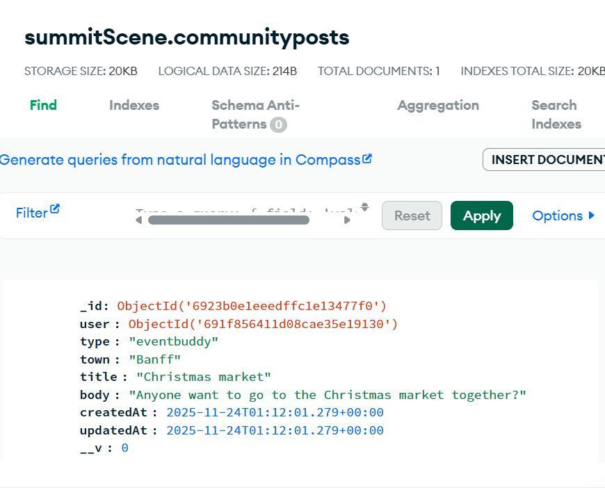

Trello Sprint — Nov 23

.png>)

Git Commit — Nov 23

Edit/Delete Buttons Working (Owner Only)

Edit Community Post Screen

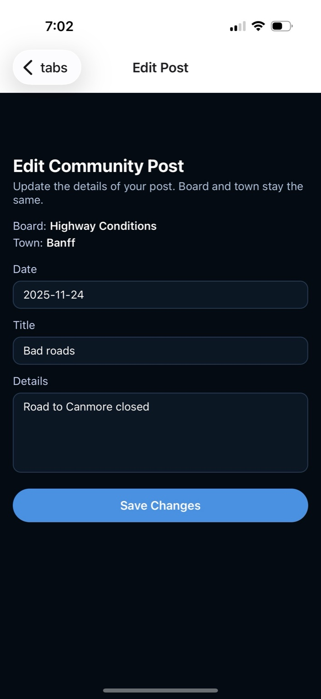

Trello Sprint — Nov 24 (Edit/Delete Completed)

Git Commit — Nov 24

## Sprint #7 - Map Tab Integration

(November 25th-26th)

### Sprint Goals

1. Install and set up the map component
2. Hook the Map tab into bottom tab navigation
3. Load events dynamically for a selected date
4. Convert event data into location markers
5. Add tap-on-marker → navigate to Event Detail
6. Add Category chips and filter markers by category
7. Maintain consistent filter design: Town + Category + Date (same as Hub)

---

### Challenges + How I Solved Them

<b>Issue: Map library wasn’t rendering initially</b>

MapView appeared blank or didn’t mount properly.

<b>Fix:</b>

Restarted Expo entirely (full stop + start), ensured the <MapView> was wrapped properly inside a fixed-height parent container with flex: 1 and overflow: hidden.

---

<b>Issue: Date string comparison didn’t match event dates</b>

Filtering events by date failed because string formats differed.

<b>Fix:</b>

Built a clean helper function that:

- Normalizes selected date
- Normalizes event.date from MongoDB
- Compares them safely regardless of timezones
  This ensured date filtering worked for both Hub and Map consistently.

---

### Wins + Breakthroughs

- Successfully integrated Expo Maps without needing extra native config
- Tapping a marker navigates into EventDetail, just like Hub
- CategoryChips + TownChips + date system now share patterns from Hub
- Map now feels like a professional “Eventbrite-style” map view
- Zero major crashes — everything worked with clean refactoring patterns

This sprint made the Map tab feel like a natural extension of the SummitScene event system.

### What I Learned This Week

- How easy map integration becomes when using Expo's react-native-maps
- How markers can pass entire event objects to navigation
- How to maintain consistent UX between Hub filters and Map filters
- How filtering logic is shared across Hub + Map with reusable helper functions

### Photos of Progress - Sprint 7

Map Integrated in App

Trello Sprint Card

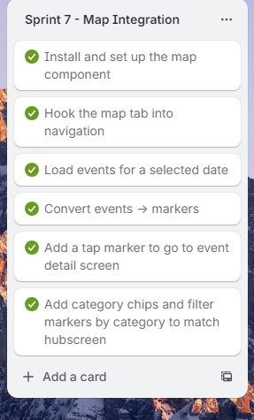

Git Commit — Nov 25

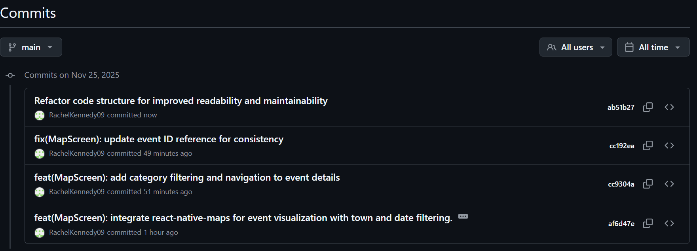

## Sprint #8 - File Polish & Codebase Cleanup

(november 25-26)

### Sprint Goals

1. Remove noisy console.log statements and switch to proper console.error for backend errors.
2. Standardize error messages and HTTP status codes across all API endpoints.
3. Clean up all controller logic to follow the same structure and flow.
4. Improve validation and data integrity for Events and Community Posts.
5. Ensure role-based access control (business vs local users) works cleanly.
6. Add clear explanatory comments for maintainability and professor readability.
7. Polish all Mongoose models for safety, readability, and consistency.

---

### Challenges + How I Solved Them

<b>Issue: RootNavigator living inside App.js </b>

This made the file too large and mixed concerns.

<b>Fix:</b>

Separated navigation into proper files for cleaner architecture.

---

<b>Issue: Typo in AuthContext (“AuthToken” vs “authToken”)</b>

This caused minor confusion and inconsistent variable naming.

<b>Fix:</b>

Corrected the typo and standardized naming across the project.

---

<b>Issue: Post New Community Event route mismatch</b>

Navigation attempted to send users to a non-existent route.

<b>Fix:</b>

Corrected route strings to match actual screen names in Community StackNavigator.

---

<b>Issue: Backend controllers had inconsistent error handling</b>

Some used console.log, some had unclear messages, some returned incorrect HTTP codes.

<b>Fix:</b>

Standardized everything to:

- console.error() for backend logging

- Clear JSON error messages

- Proper status codes (400/401/404/500)

- Same controller structure for all endpoints

---

<b>Issue: Email case sensitivity could cause duplicate accounts</b>

“RACHEL@email.com
” and “rachel@email.com
” were treated as separate users.

<b>Fix:</b>

Normalized email to lowercase in both register and login routes.

---

### Wins + Breakthroughs

- All backend files now follow a clean, consistent, professional structure.
- Every route now has proper validation, error handling, and comments explaining the flow.
- Models are validated and include schema-level protections, enums, and virtuals.
- The codebase is now much easier to debug and maintain long-term.

### What I Learned This Week

- How to use Mongoose models effectively with enums, virtuals, and validation rules.
- The difference between frontend logging vs backend logging (only errors belong in logs for backend).
- How to design clean REST API endpoints that are easy for mobile apps to consume.
- How to build consistent API responses that make debugging easier across the entire app.

#### Photos of Progress - Sprint 8

Trello Cards Completed (Nov 25)

Git Commits — Nov 25
.png>)
.png>)

Frontend File Cleanup — Nov 26

.png>)
.png>)

Backend Cleanup Commit — Nov 26

.png>)

Sprint 8 Completed

