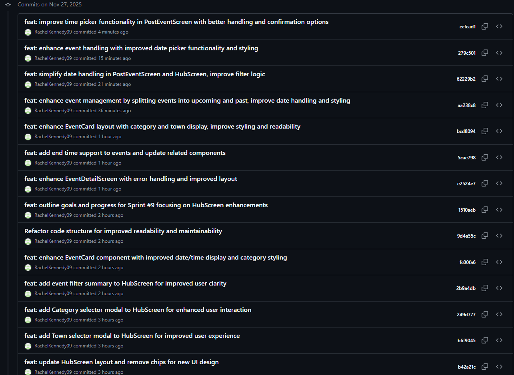
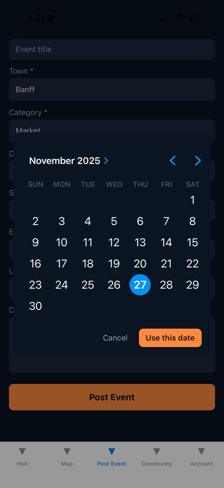
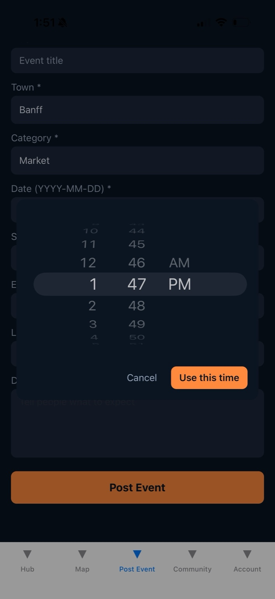
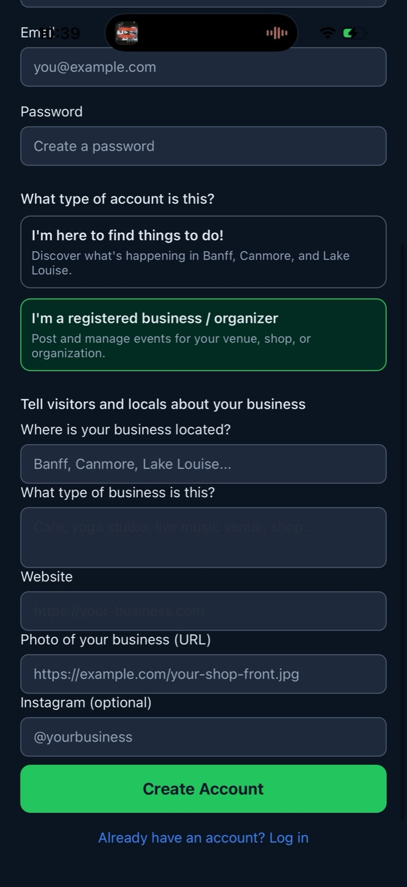
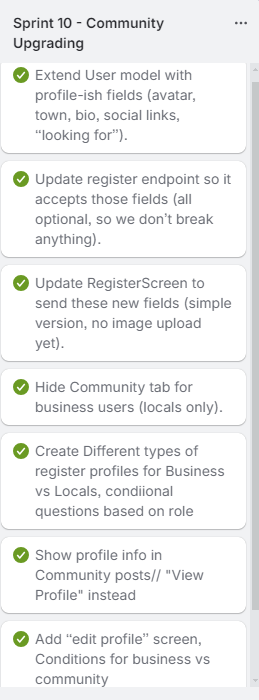
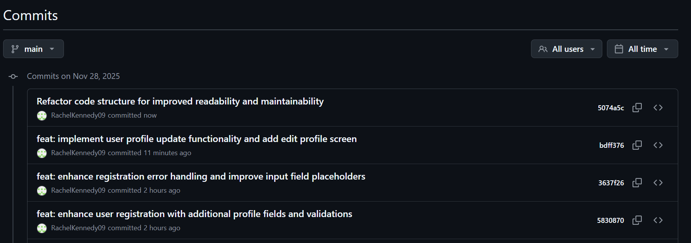
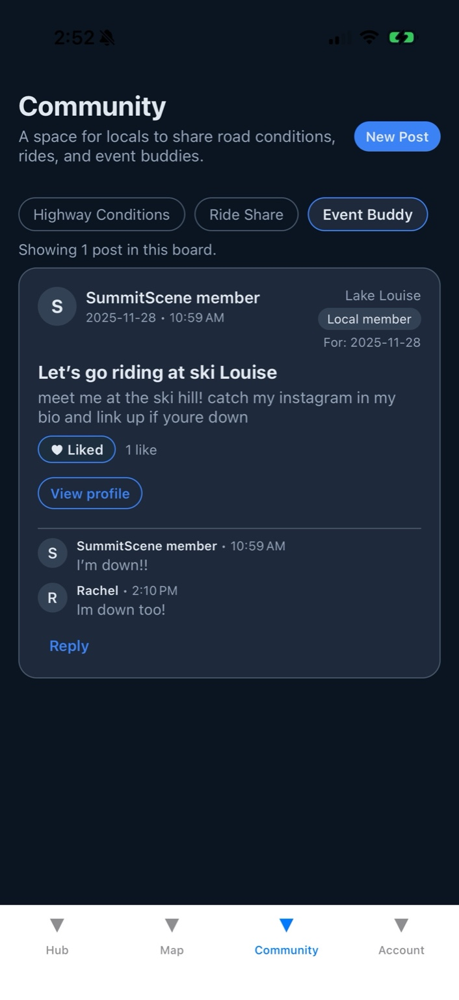
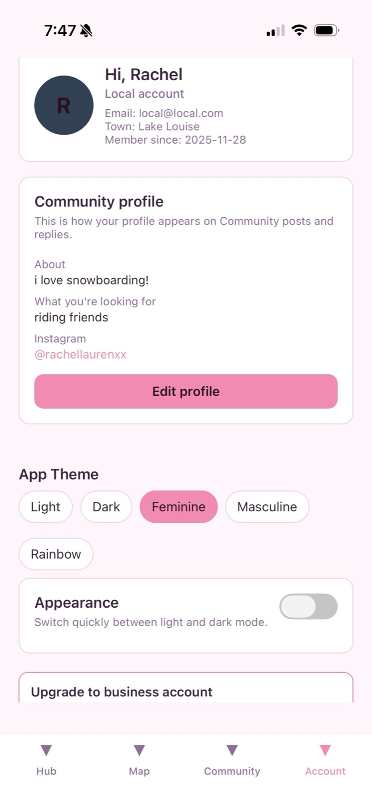
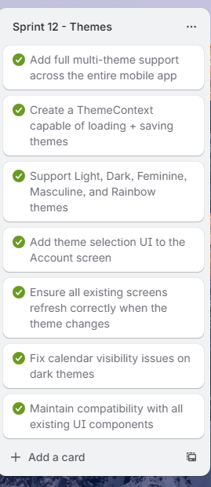
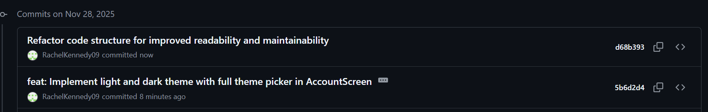

# Upgrades and Polishing DevLog Phase 2

(November 27-)

#### It Includes:

- File cleanup

- inting

- Error-handling standardization

- Mongoose improvements

- Navigation polish

- UI fixes

- Pre-submission polishing

## 📅 Sprint #9 UI Polish, Navigation Cleanup & Final Refinements

(November 27)

#### Sprint Goals

### HubScreen Polish

1. Add a new Hero Section
2. Create reusable PillButtons component
3. Build Town Selector Modal
4. Build Category Selector Modal
5. Hook pill components into existing Hub filters
6. Add Date pill + filtering logic

### Event Polish

1. Add event end time to event model
2. Add fresh styling to event cards
3. Business users see "My Past Events"
   \*\*\*PLEASE NOTE: for development and grading purposes, I left the date handling to be able to choose a PAST date, so you can see the "My past events" feature. Otherwise I would add error handling so people couldnt post an event on a already past date.
4. Local users do not see Past events, it is removed from Event Hub
5. Better handling on the "Date Picker" on PostEventScreen so people can choose todays date easier, and click confirm/cancel for easier handling
6. Better handling on the "Time Picker" on PostEventScreen so people can choose start and end times easier, and click confirm/cancel for easier handling
7. Edit "EditEventScreen" after making changes to PostEventScreen

### Account Polish

1. Add token key so user doesnt get logged out/memory loss when rloading the application
2. Add " Youre logged in as a business/local user"
3. Add "Hello, ${NAME}, Welcome to your summit scene hub

### Map Polish

1. Add Town, Category, Date pills like HubScreen
2. Zoom effect when choosing a town on map

### Community Polish

1. Town filter pills with a modal
2. Summary line after choosing town
3. Show an identity to the posts (Who posted)
4. Reply options

### Wins & Breakthroughs

- HubScreen aesthetics upgraded significantly with new hero + pill filtering
- Event creation/editing flow is now much more user-friendly
- Account screen finally feels welcoming and personalized
- Map filtering is now consistent with Hub filters, improving UX cohesion
- Community board now feels social, interactive, and properly moderated
- Session persistence is smooth — no accidental logouts
- This sprint elevated the app from “working prototype” to a polished, professional mobile experience

### What I Learned This Sprint

- How UI consistency dramatically improves user flow
- How to build reusable components (PillButtons) to reduce duplicate code
- How to enhance date/time UX on mobile for real users
- How to use animated Map actions (zoom-to-town) to improve clarity
- How to add identity, replies, and context to community systems
- How small polish items can feel like huge upgrades for the end user

#### Photos of Progress - Sprint 9

Trello Cards - Hubscreen and Event Polish

Git commit - HubScreen and Event Styling

App ScreenShot - Town, Category, Date pills

Improved Date Picker UI

Improved Time Picker UI

MongoDB - Reply array

GitCommit Nov 27th Sprint 9 Completion

## Sprint 10 - Local Profiles + Community Access

### Sprint Goals

1. Add rich user profiles (avatar, town, bio, lookingFor, Instagram, website).
2. Integrate profiles into Community posts with a “View Profile” modal.
3. Allow locals and businesses to edit their profile details (new EditProfileScreen).
4. Differentiate Local vs Business profile wording (“Community Profile” vs “Event Posting Profile”).
5. Add role-based profile preview in Account screen.
6. Set up user profile update route on backend (PATCH /api/users/update-profile).

---

### Challenges + How I Solved Them

<b>Issue: Enum validation blocked real towns (e.g. "lake louise").</b>

When registering, the backend refused certain valid towns because the town enum was too strict.

<b>Fix:</b>

Relaxed the validation:

- Allowed lowercase town values

- Expanded accepted choices

Now registration supports real places like Lake Louise without errors.

---

<b>Issue: Profile information cluttered the Community cards and became overwhelming. </b>

Showing town, email, lookingFor, Instagram, and business website inside each post made the cards feel busy and messy.

<b>Fix:</b>

Implemented a clean, dedicated “View Profile” modal:

- Community cards now show only essential info

- Full profile displayed only when tapped

This keeps the feed clean and focused.

---

<b>Issue: Business and Local users needed different profile contexts.</b> Locals use profiles for Community, while businesses use profiles for Event Hosting — but wording was identical, causing confusion.

<b>Fix:</b>

Added role-based UI copy:

Local: “Community profile — This is how your profile appears on Community posts and replies.”

Business: “Event posting profile — This is how your profile appears when you host events.”

This makes the experience personalized and professional.

---

<b>SIDE Issue: Deleted user on MongoDB and user was still able to make an event post(business)</b>

If a user was removed from MongoDB, they could still technically send a POST request using an old token.

<b>Fix:</b>

Added an additional backend validation layer:

- Auth middleware now checks if the user still exists in the database before event posting

- Prevents ghost accounts from creating events

### Wins + Breakthroughs

- Added full role-based profiles with clean editing UX.
- Community posts now show a profile modal, not cluttered cards.
- Introduced a dedicated AccountStack for cleaner navigation architecture.
- Profile section on AccountScreen now adapts to Local vs Business.
- Registration fully supports richer fields without crashing.
- Laid foundation for changing email/password in a future sprint.

### What I Learned

- How to build role-specific UI experiences with conditional rendering
- How to extend auth + user models safely with new profile fields
- How meaningful UX improvements come from separating concerns (modal vs card clutter)
- How backend validation must complement frontend logic for true security

---

### photos of progress Sprint 10

Enum Error Screenshot (Too Strict Validation)

Local User Profile UI

Business User Profile UI

Tre

Trello Card completed Sprint 10

Git commit

## Sprint 11 - Community Reply Upgrade, Profile info in replies & Likes.

### Sprint Goals

1. Add the ability for users to like community posts
2. Improve identity on replies by showing each replier’s full profile info
3. Populate author details correctly for all replies (name, avatar, role, town, etc.)
4. Improve UI for replies (timestamp styling, avatars, and profile modal integration)
5. Add frontend logic to detect if the logged-in user already liked a post

### Challenges + How I Solved Them

<b>Issue: Replies were showing “SummitScene member” instead of the user’s real profile</b>

Backend reply schema wasn’t fully populated, and the frontend wasn’t pulling full user details.

<b>Fix:</b>

Added backend .populate("replies.user", "name role avatarUrl town lookingFor instagram bio website")

- Updated frontend reply UI to reference reply.user when populated

- Replies now show:
  ✓ Avatar
  ✓ Name
  ✓ Role
  ✓ Town
  ✓ Social links
  ✓ Bio

---

<b>Issue: Likes were not implemented for Community posts </b>

The model had no like logic, and no controller existed to toggle likes.

<b>Fix: </b>

- Added likes: [ObjectId] array to CommunityPost model

- Created dedicated route: PATCH /api/community/:id/likes

- Implemented toggle logic (add/remove based on user ID)

- Added like button + count + active highlight to the frontend

- Reloaded posts after like/unlike to sync UI with backend

---

<b>Issue: Reply timestamps were hard to read (text showing in black) </b>

No color styling existed for the reply meta text.

<b>Fix:</b>

Added new replyMeta style using colors.textMuted, making timestamps readable and consistent across the UI.

### Wins + Breakthroughs

- Replies now fully show the correct user profile data (avatar, name, town, role)
- Added View Profile modal support for replied users
- Community posts now support likes, with accurate highlight state
- Reply UI feels polished — timestamps styled, avatars aligned, and better readability
- Backend + frontend now fully in sync for community interactions
- Community board feels far more social and interactive — massive UX upgrade

### What I Learned

- How to populate nested fields inside array subdocuments
- How to structure a “toggle” route (idempotent like/unlike flow)
- How to sync UI state with the backend using fetchPosts() after update
- Importance of designing models to support future features (likes, replies, etc.)

### photos of progress Sprint 11

Replies with Identity + Likes UI

Trello Sprint done

---

## Sprint 12: Light and Dark Theme System

### Sprint Goals

1. Add full multi-theme support across the entire mobile app
2. Build a ThemeContext capable of loading + saving themes
3. Support Light, Dark, Feminine, Masculine, and Rainbow themes
4. Add theme selection UI to the Account screen
5. Ensure all existing screens refresh correctly when the theme changes
6. Fix calendar visibility issues on dark themes
7. Maintain compatibility with all existing UI components

### Challenges + How I Solved Them

<b>Issue: Date picker numbers invisible on dark mode </b>

On Android, the calendar day numbers stayed black even when switching into dark theme, making them unreadable.

<b>Fix:</b>

- Wrapped the DateTimePicker inside a themed white card background
- Applied themeVariant={theme.isDark ? "dark" : "light"} as a fallback for iOS
- Ensured backgroundColor: theme.card is forced behind all pickers

---

<b>Issue: Some components were not re-rendering when theme changed</b>

A few screens cached their styles and didn’t refresh when changing themes.

<b>Fix:</b>

- Switched all style definitions to use useTheme() instead of static StyleSheets

- Ensured every screen reads theme values dynamically

- Confirmed Context re-renders propagate through TabNavigators, StackNavigators, and modals

---

<b>Issue: Accent colors were inconsistent across themes</b>

Some components used hardcoded colors—causing mismatches when switching theme palettes.

<b>Fix:</b>

- Standardized all colors into a unified token system:

  - theme.background
  - theme.card
  - theme.text
  - theme.textMuted
  - theme.accent
  - theme.border

- Replaced all hardcoded colors across the project

### Wins + Breakthroughs

- Added 5 complete global themes across the entire app
- ThemeContext now supports unlimited future themes (extremely scalable)
- Added a polished, user-friendly theme selector with pill buttons
- Entire UI instantly updates when switching themes
- Improved readability and compatibility for native pickers
- Created a reliable token-based design foundation for all future UI polish

### What I Learned

- How to architect a reusable, global theme system in React Native
- How to build theme palettes with a token-based architecture
- How to theme resistant native components (DateTimePicker, modals, spinners)
- How global state (Context) controls large-scale UI transformations
- Why consistency and tokenization are essential for flexible app design

### photos of progress Sprint 12

Theme Selection Pills — AccountScreen

Trello sprint 12 - themes completed

Git Commit - Sprint 12

---

## Sprint 13 - File Cleanup before more features

(November 30-December 2)

### Sprint Goals

1. Clean up and modularize the Community tab
2. Clean up and modularize the Hub tab
3. Polish the Account tab with proper theming and structure
4. Refactor the Map screen for clarity + shared filter logic
5. Consolidate shared UI for Event screens (Detail, Edit, Post)

---

### Challenges + How I Solved Them

<b>Issue: CommunityScreen was ~1500 lines and becoming unmanageable</b>

The file mixed UI, backend logic, modals, and profile rendering all in one place.

<b>Fix:</b>

- Moved all backend requests to a new communityApi.js service
- Extracted profile UI into MemberProfileModal.js
- Screen now focuses on:
  - loading posts
  - filtering
  - rendering the main layout
    This follows clean separation of concerns.

---

<b>Issue: HubScreen was nearly 1000 lines and mixing filters + rendering</b>

Filter UI, constants, and list rendering all lived in one giant file.

<b>Fix:</b>

- Extracted entire filter/header area into a reusable HubFilters component
- Centralized TOWNS, CATEGORIES, and DATE_FILTERS constants
- HubScreen now focuses only on:
  - loading events
  - filtering logic
  - result summary
  - simple renderEvent() function
    Much easier to extend for future Sprint 14–15 upgrades.

---

<b>Issue: AccountScreen hard-coded colors + “styles.something” bug </b>

Using raw colors._ broke theme support. The file also referenced styles._ incorrectly, causing UI errors.

<b>Fix:</b>

- Converted all color usage to useTheme() token values
- Replaced every hard-coded color with theme tokens (text, muted, card, accent, etc.)
- Fixed the styles reference bug
- Wired in the full theme picker (light/dark/feminine/masculine/rainbow)

---

<b>Issue: MapScreen duplicated much of the Hub filter logic
</b>

Town/Category/Date filtering was repeated across two different screens.

<b>Fix:</b>

- Extracted a dedicated MapFilters component
- Reused the exact same filtering logic as Hub
- MapScreen now only handles:
  - markers
  - region
  - camera animations
  - map rendering
    Filtering UI is unified across Hub + Map.

---

<b>Issue: Event screens (Detail, Edit, Post) all implemented their own pickers and modals</b>

This caused massive duplication and inconsistent UX.

<b>Fix: A shared “Event UI Cleanup” pass</b>

- **EventDetailScreen**

  - Kept all the business logic (delete, navigate to Edit, host detection), but cleaned up how the UI uses `theme` for colors.
  - Confirmed the “Hosted by” section uses a helper (`getEventHost`) so it only shows for business users.
  - Made the owner-only area (“This is your event”, Edit / Delete buttons) clean and theme-aware.

- **EditEventScreen**

  - Swapped inline date/time pickers over to shared components:
    - `DatePickerModal` for dates
    - `TimePickerModal` for start and end times
    - `SelectModal` for Town and Category
  - Reused the same date formatting and time handling pattern as Post Event.
  - This removed a lot of inline `<Modal>` markup and duplicate button layouts.

- **PostEventScreen**
  - Removed the inline `TimePickerModal` definition from this file and replaced it with the shared `TimePickerModal` component.
  - Replaced town/category modals with reusable `SelectModal`.
  - Hooked up `DatePickerModal` to use the same `dateObj → "YYYY-MM-DD"` helper.
  - Kept all of the existing business logic (401 session expired → logout, 403 not a business, success → reset form + navigate to MyEvents).

This makes adding new event UI behaviors incredibly easy going forward.

---

### Wins + Breakthroughs

- Shortened code and made the Community tab more organized by moving API logic into `communityApi.js` and profile UI into `MemberProfileModal.js`.
- Extracted a `HubFilters` component so the Hub screen is focused on data + list rendering, not giant chunks of UI markup.
- Cleaned up the Account tab to use `useTheme()` properly and fixed the `styles` vs `theme` bug, while also wiring in theme selection options.
- Extracted a `MapFilters` component and aligned the Map filters (town/category/date) with the Hub tab, making the experience consistent across screens.
- Reused shared UI pieces (`DatePickerModal`, `TimePickerModal`, `SelectModal`) between Post Event and Edit Event, removing a big chunk of duplicated `<Modal>` code.
- Made the Event Detail / owner tools more readable and theme-aware without changing the core logic.

---

### What I Learned

- How to **separate concerns** in a React Native app: screens should orchestrate data + navigation, while components handle UI and layout.
- That extracting **shared components** (filters, pickers, select modals) not only shortens files, but also makes future feature changes safer and faster.
- How to lean on a central **ThemeContext** instead of hard-coded colors so new themes (light, dark, feminine, masculine, rainbow) “just work” across screens.
- That cleanup sprints are just as important as feature sprints — once the screens are smaller and more modular, it’s mentally easier to add new features without fear of breaking everything.

### photos of progress Sprint 13

---

## Sprint 14: Map Marker Fix + Visual Improvements

(Dec 4)

### Sprint Goals

1. Fix missing markers on MapScreen
2. Add "Marker Fan-Out" system
3. Improve debugging visibility
4. Increase marker offset for professor demo
5. Prepare Map tab for polished demonstration

### Challenges + How I Solved Them

<b>Issue:</b>

Several newly created events were not appearing on the map. Only 2–3 markers were showing, even though the backend had many events.

<b>Fix:</b>

After investigating with debug logs, I confirmed events were loading correctly — the issue was marker overlapping. Multiple events in the same town (Banff/Canmore) shared the exact same coordinates.

- Added a Marker Fan-Out helper to slightly offset each marker so they all appear individually.

---

<b>Issue:</b>

Map logic was still stacking markers because the offset distance was too small for the current zoom level, so the “fan” was not visually noticeable.

<b>Fix:</b>

Increased offset from 0.003 to a more visible 0.02 so markers clearly spread out for demo purposes. This instantly made all events appear on the map.

---

<b>Issue: </b>

Hard to verify which events were included in filtering. No visibility into the number of events being passed to the map.

<b>Fix:</b>

Added temporary debug logs inside eventsForMap to print:

- event count
- event titles
- towns
- dates
  This allowed me to confirm the filtering logic was correct and that the missing markers were due to overlapping, not filtering or backend issues.

### Wins + Breakthroughs

- Map now displays all 8+ sample events, even when multiple share the same town.
- Filters (Town, Category, Date) all work cleanly and update markers instantly.
- All markers are now clickable and lead to the correct EventDetail page.
- Map visually looks much more polished and feels ready for instructor testing.
- Created a reusable offset helper that keeps markers clean and readable.

### What I Learned

- Even when the backend and filtering logic are correct, UI overlap can hide data.
- Debug logs are essential for diagnosing filtering vs. UI issues.
- Map markers require careful spatial adjustments to avoid stacking.
- Increasing visual exaggeration is sometimes necessary for demos (professors won’t zoom in/out).
- Consistency between Hub filtering and Map filtering greatly improves maintainability.
