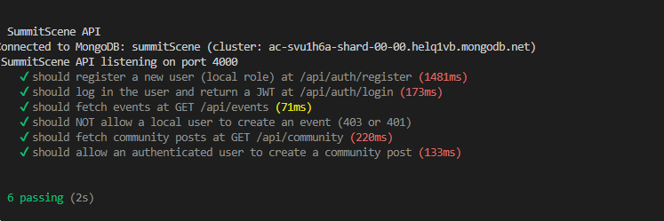
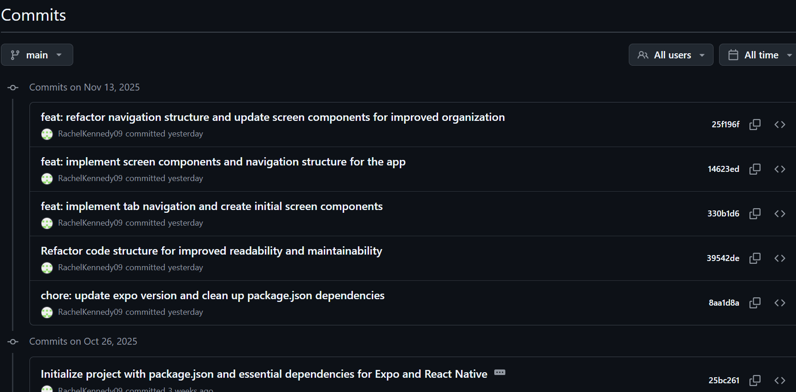
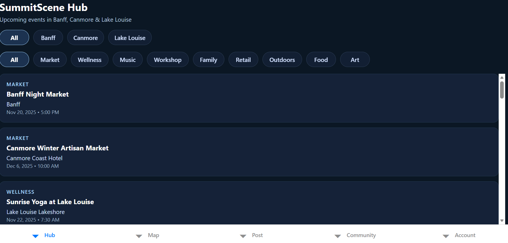
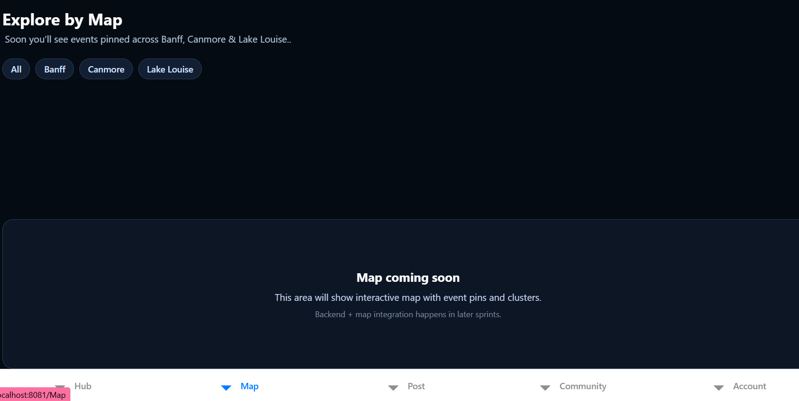
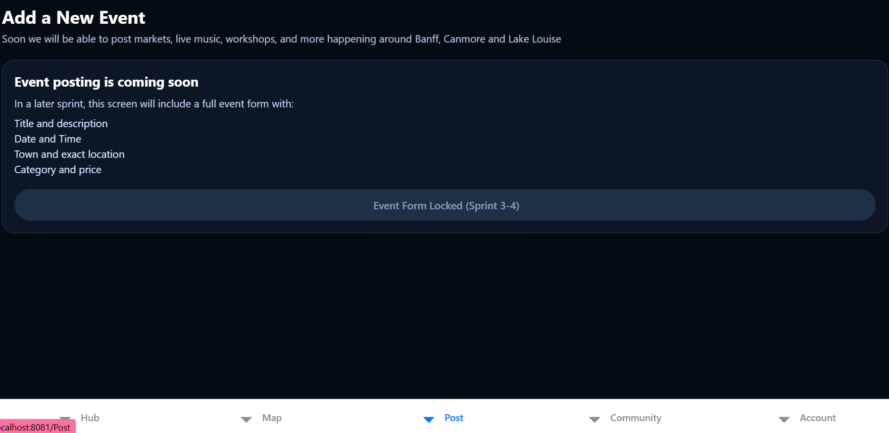
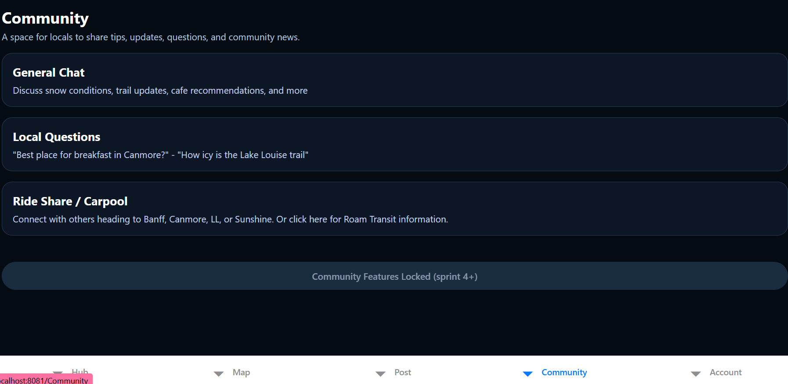
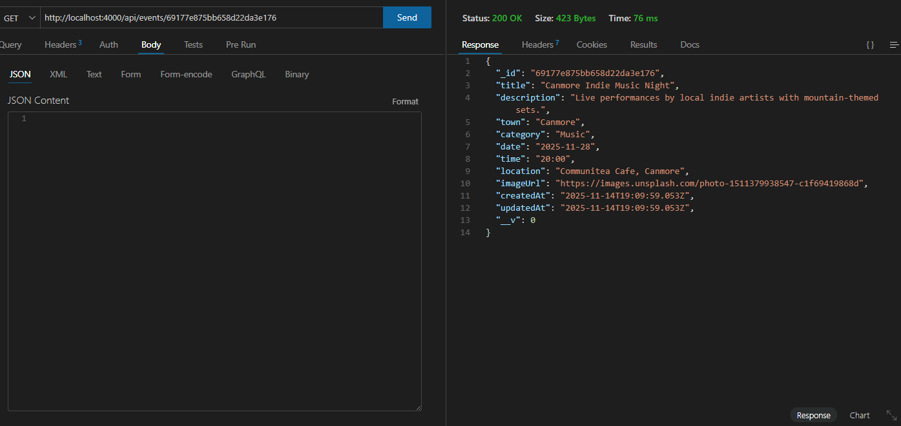
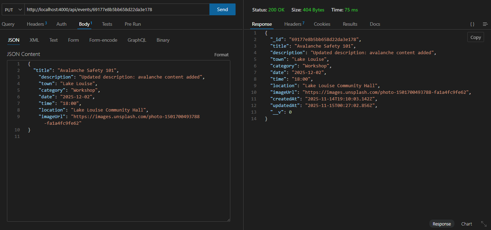
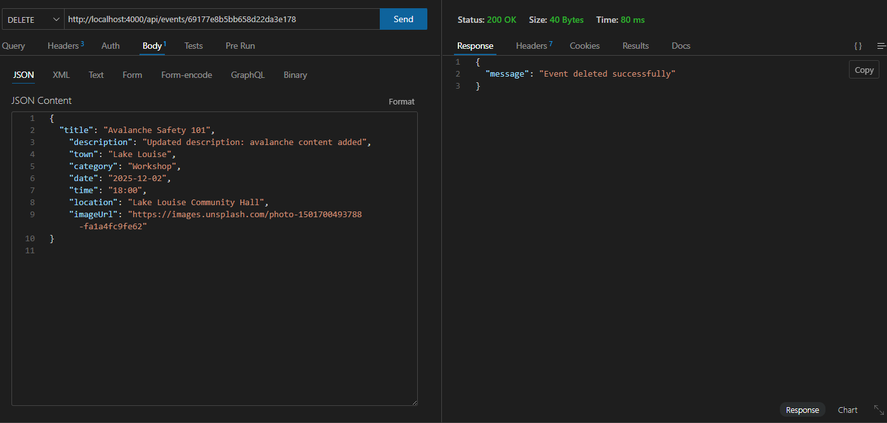
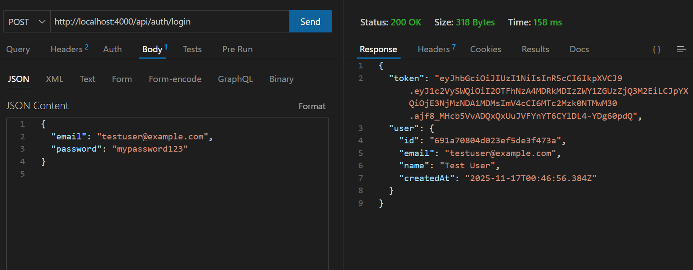

# Sprint #1 Foundations and Events (Nov 13 - Oct 14)

### 🎯 Sprint Goals

1. Set up Expo project + folder structure
2. Install React navigation + Bottom tabs
3. Create placeholder screens for: Hub, Map, Community, Account
4. Add tri-town filter tabs (Banff, Canmore, Lake Louise)
5. Design the first Event Card
6. Build static HubScreen with mock events
7. Add category filter chips

### 🔥 Challenges + How I Solved Them

<b>Issue: App folder vs. server folder confusion</b>

<b>Fix:</b> Reorganized project using only /server for API. Confirmed both run separately (npx expo start + node server/index.js).

<b> Issue: Started with Expo Router + TSX without enough practice</b>
<b>Fix:</b>Removed the experimental TSX pages and returned to standard React Native + JS. This made the project easier to maintain.

### 🌟 Wins + Breakthroughs

- Very few errors — completed Sprint 1 in a single day.

- Clearer understanding of mobile-first folder structure.

- Realized building static UI with mock events early helps visualize the final product.

### 📚 What I Learned This Sprint

- How to keep UI simple while still designing meaningful placeholders.

- Importance of installing the correct navigation + safe-area dependencies early.

- Planning UI first makes backend integration much smoother later.

---

### Photos of Progress - Sprint 1

#### Trello Sprint

#### Github commits

#### Screens (Hub, Map, Post, Community, Account)

---

---

## 📅 Sprint #2 Backend and Events api ( November 14th)

### 🎯 Sprint Goals

1. Set up Node + Express + MongodbSet up Node + Express + MongoDB
2. Connect to MongoDB Atlas
3. Define Event model (title, description, town, category, date, time, location, lat/lng, imageUrl)
4. Seed example events for Banff/Canmore/Lake Louise
5. Implement full CRUD (Create, Read, Update, Delete)
6. Connect HubScreen to backend (fetch events)
7. Add loading & error states
8. Filter events by town
9. Create full Event Details Screen
10. Add pull-to-refresh behavior

---

### 🔥 Challenges + How I Solved Them

<b>Issue: MongoDB “bad auth” authentication error</b>

<b>Fix:</b>

- Updated .env with correct connection string
- Ensured database user permissions were correct
- Enabled IP Access: 0.0.0.0/0
- Successfully connected after rewriting connection code in ESM format

---

<b>Issue: HubScreen.js ballooned to 400+ lines</b>

<b>Fix:</b>
Refactored into smaller components:

- EventCard.js
- TownChips.js
- CategoryChips.js

This improved readability, maintainability, and overall organization.

---

<b>Issue: EventDetails was mistakenly added as a Tab</b>

<b>Fix:</b> Moved EventDetailScreen into a Stack Navigator instead of the tab bar.
Tabs now handle main navigation; details are pushed on top.
Navigation behavior is now correct and professional.

---

<b>Issue: Pull-to-refresh spinner appeared black in Expo Go</b>
<b>Fix:</b>Native spinner ignored color props → created my own custom white spinner overlay for a consistent experience and added a small minimum delay for smoother UX.

---

### 🌟 Wins + Breakthroughs

- First successful API call from mobile app → Express server 🎉

- Displayed real MongoDB events inside the Hub feed

- Implemented combined mock + live data for strong development flow

- Navigation between Hub → Event Details works perfectly

- App loads smoothly on Expo Go through LAN

- Began proper API documentation

- Built a polished Event Detail screen with hero image + scroll layout

---

### 📚 What I Learned This Week

- How to connect Express to a MongoDB Atlas database securely

- How to test endpoints in Thunder Client and verify CRUD functionality

- A much deeper understanding of structuring:

  - App.js
  - TabNavigator
  - RootNavigator
  - and how stacks + tabs work together

- Better error handling around network requests and fallback mock data

- How to improve UI performance with loading states + pull-to-refresh

---

#### Photos of Progress - Sprint 2

##### Trello Sprint

##### MongoDB Connected Successfully

"Connected to Mongo as of Nov 14th"

##### Github Commits

##### CRUD Thunderclient

POST

GET ALL

GET BY ID

UPDATE

DELETE

---

## 📅 Sprint #3 (November 16th-)

### 🎯 Sprint Goals

1.
2.
3.
4.
5.
6.
7.
8.
9.
10.

---

### 🔥 Challenges + How I Solved Them

<b>Issue: I realized I pushed my .env file to github accidentally.</b>

<b>Fix: I deleted the .env and ensured it wouldnt keep getting pushed to my github. And then I re-created a mongoDB cluster so no one could attack.</b>

---

<b>Issue: After doing my authstack and appstack i was getting nework request failed. </b>

<b>Fix:</b>

---

<b>Issue: </b>

<b>Fix:</b>

---

<b>Issue: </b>
<b>Fix:</b>

---

### 🌟 Wins + Breakthroughs

- understanding get /auth/me and expired tokens.

-

-

-

-

-

- ***

### 📚 What I Learned This Week

- Wrapping head around security details and ensuring yout hit every one can be draining. There are so many ways to get around security so you need to make sure you are thinking critically through the login/register process. Even ensuring you use the right words in your error messages.

- Choosing a 24 hour token expiry over 7 days. I wanted a more realistic app feel. It is more secure than 7 days and less annoying than 15 minutes. Especially for my professor while they are grading. That is why i chose 24hrs

- Protecting the event routes so that only logged in users and user who posted the event can modify it. 

-

- ***

#### Photos of Progress - Sprint 3

November 16th - finished LoginScreen.js, RegisterScreen.js, AuthContext, User model, and auth routes

Github commit

#### POSt /auth/login

#### POST /auth/register

## 

---

November 17th - Auth stack, appstack

## 📅 Sprint #4 ()

### 🎯 Sprint Goals

1.
2.
3.
4.
5.
6.
7.
8.
9.
10.

---

### 🔥 Challenges + How I Solved Them

<b>Issue: </b>

<b>Fix:</b>

---

<b>Issue: </b>

<b>Fix:</b>

---

<b>Issue: </b>

<b>Fix:</b>

---

<b>Issue: </b>
<b>Fix:</b>

---

### 🌟 Wins + Breakthroughs

-

-

-

-

-

-

- ***

### 📚 What I Learned This Week

-

-

-

-

- ***

#### Photos of Progress - Sprint 4

---

## 📅 Sprint #5 ()

### 🎯 Sprint Goals

1.
2.
3.
4.
5.
6.
7.
8.
9.
10.

---

### 🔥 Challenges + How I Solved Them

<b>Issue: </b>

<b>Fix:</b>

---

<b>Issue: </b>

<b>Fix:</b>

---

<b>Issue: </b>

<b>Fix:</b>

---

<b>Issue: </b>
<b>Fix:</b>

---

### 🌟 Wins + Breakthroughs

-

-

-

-

-

-

- ***

### 📚 What I Learned This Week

-

-

-

-

- ***

#### Photos of Progress - Sprint 5

---

## 📅 Sprint #6 ()

### 🎯 Sprint Goals

1.
2.
3.
4.
5.
6.
7.
8.
9.
10.

---

### 🔥 Challenges + How I Solved Them

<b>Issue: </b>

<b>Fix:</b>

---

<b>Issue: </b>

<b>Fix:</b>

---

<b>Issue: </b>

<b>Fix:</b>

---

<b>Issue: </b>
<b>Fix:</b>

---

### 🌟 Wins + Breakthroughs

-

-

-

-

-

-

- ***

### 📚 What I Learned This Week

-

-

-

-

- ***

#### Photos of Progress - Sprint 6

---

## 📅 Sprint #7 (November 16th)

### 🎯 Sprint Goals

1.
2.
3.
4.
5.
6.
7.
8.
9.
10.

---

### 🔥 Challenges + How I Solved Them

<b>Issue: </b>

<b>Fix:</b>

---

<b>Issue: </b>

<b>Fix:</b>

---

<b>Issue: </b>

<b>Fix:</b>

---

<b>Issue: </b>
<b>Fix:</b>

---

### 🌟 Wins + Breakthroughs

-

-

-

-

-

-

- ***

### 📚 What I Learned This Week

-

-

-

-

- ***

#### Photos of Progress - Sprint 7
