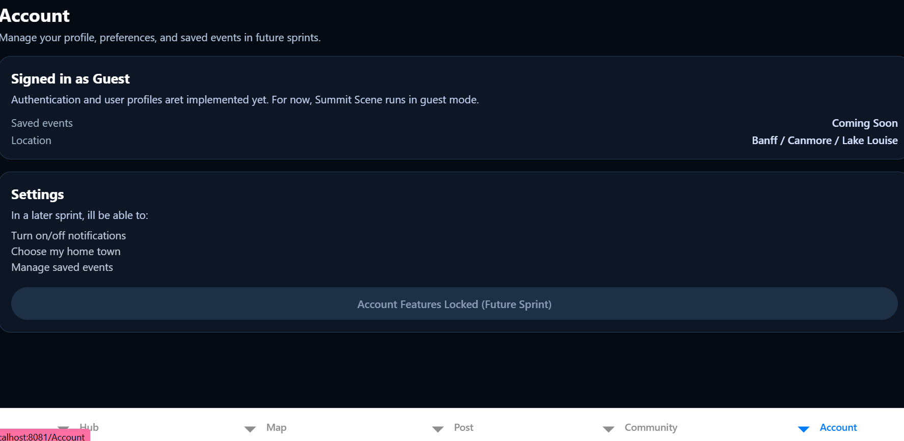
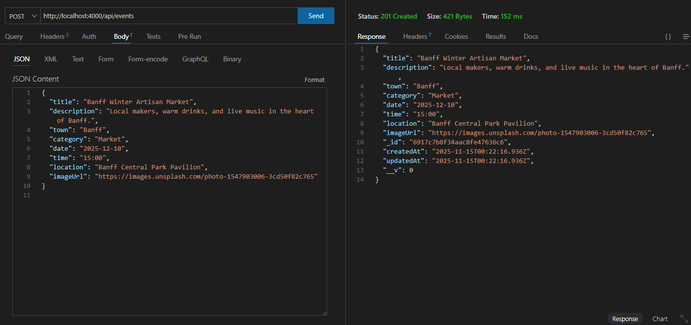
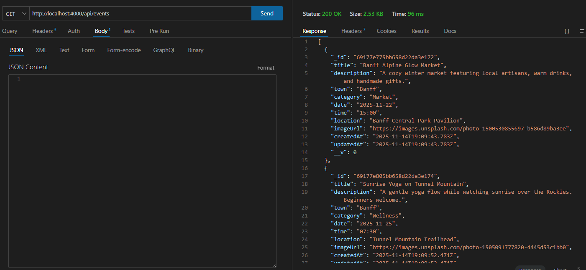
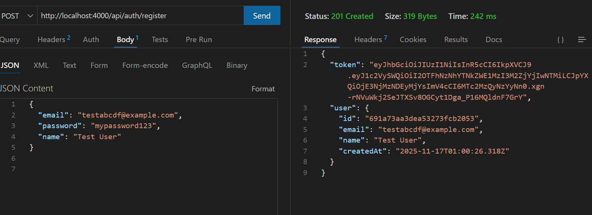
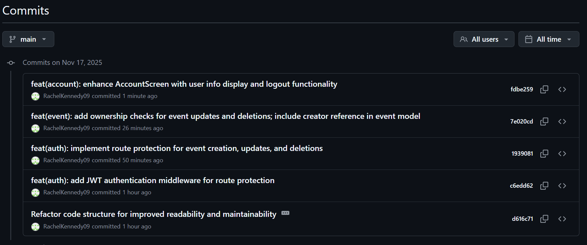
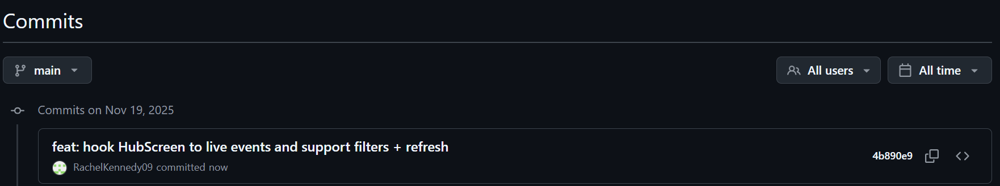
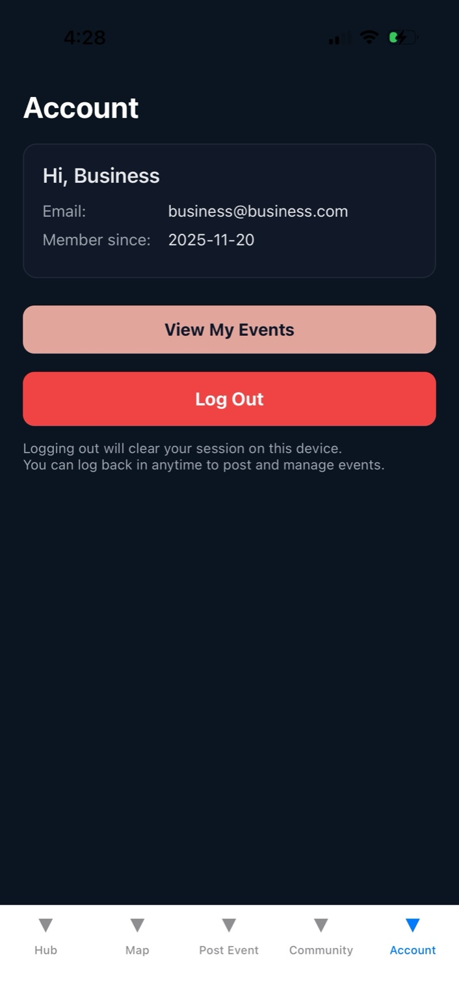
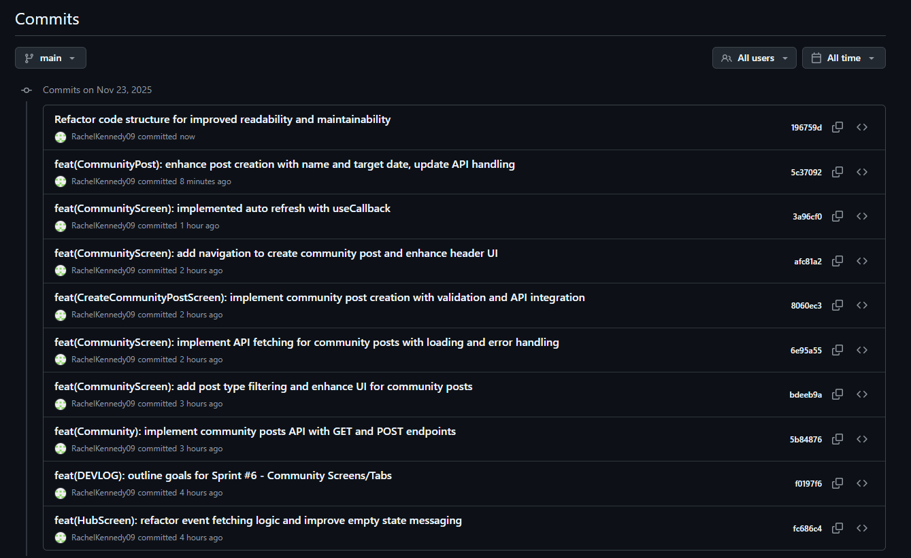

# Sprint #1 Foundations and Events (Nov 13 - Oct 14)

### 🎯 Sprint Goals

1. Set up Expo project + folder structure
2. Install React navigation + Bottom tabs
3. Create placeholder screens for: Hub, Map, Community, Account
4. Add tri-town filter tabs (Banff, Canmore, Lake Louise)
5. Design the first Event Card
6. Build static HubScreen with mock events
7. Add category filter chips

### 🔥 Challenges + How I Solved Them

<b>Issue: App folder vs. server folder confusion</b>

<b>Fix:</b> Reorganized project using only /server for API. Confirmed both run separately (npx expo start + node server/index.js).

<b> Issue: Started with Expo Router + TSX without enough practice</b>
<b>Fix:</b>Removed the experimental TSX pages and returned to standard React Native + JS. This made the project easier to maintain.

### 🌟 Wins + Breakthroughs

- Very few errors — completed Sprint 1 in a single day.

- Clearer understanding of mobile-first folder structure.

- Realized building static UI with mock events early helps visualize the final product.

### 📚 What I Learned This Sprint

- How to keep UI simple while still designing meaningful placeholders.

- Importance of installing the correct navigation + safe-area dependencies early.

- Planning UI first makes backend integration much smoother later.

---

### Photos of Progress - Sprint 1

#### Trello Sprint

#### Github commits

#### Screens (Hub, Map, Post, Community, Account)

---

---

## 📅 Sprint #2 Backend and Events api ( November 14th)

### 🎯 Sprint Goals

1. Set up Node + Express + MongodbSet up Node + Express + MongoDB
2. Connect to MongoDB Atlas
3. Define Event model (title, description, town, category, date, time, location, lat/lng, imageUrl)
4. Seed example events for Banff/Canmore/Lake Louise
5. Implement full CRUD (Create, Read, Update, Delete)
6. Connect HubScreen to backend (fetch events)
7. Add loading & error states
8. Filter events by town
9. Create full Event Details Screen
10. Add pull-to-refresh behavior

---

### 🔥 Challenges + How I Solved Them

<b>Issue: MongoDB “bad auth” authentication error</b>

<b>Fix:</b>

- Updated .env with correct connection string
- Ensured database user permissions were correct
- Enabled IP Access: 0.0.0.0/0
- Successfully connected after rewriting connection code in ESM format

---

<b>Issue: HubScreen.js ballooned to 400+ lines</b>

<b>Fix:</b>
Refactored into smaller components:

- EventCard.js
- TownChips.js
- CategoryChips.js

This improved readability, maintainability, and overall organization.

---

<b>Issue: EventDetails was mistakenly added as a Tab</b>

<b>Fix:</b> Moved EventDetailScreen into a Stack Navigator instead of the tab bar.
Tabs now handle main navigation; details are pushed on top.
Navigation behavior is now correct and professional.

---

<b>Issue: Pull-to-refresh spinner appeared black in Expo Go</b>
<b>Fix:</b>Native spinner ignored color props → created my own custom white spinner overlay for a consistent experience and added a small minimum delay for smoother UX.

---

### 🌟 Wins + Breakthroughs

- First successful API call from mobile app → Express server 🎉

- Displayed real MongoDB events inside the Hub feed

- Implemented combined mock + live data for strong development flow

- Navigation between Hub → Event Details works perfectly

- App loads smoothly on Expo Go through LAN

- Began proper API documentation

- Built a polished Event Detail screen with hero image + scroll layout

---

### 📚 What I Learned This Week

- How to connect Express to a MongoDB Atlas database securely

- How to test endpoints in Thunder Client and verify CRUD functionality

- A much deeper understanding of structuring:

  - App.js
  - TabNavigator
  - RootNavigator
  - and how stacks + tabs work together

- Better error handling around network requests and fallback mock data

- How to improve UI performance with loading states + pull-to-refresh

---

#### Photos of Progress - Sprint 2

##### Trello Sprint

##### MongoDB Connected Successfully

"Connected to Mongo as of Nov 14th"

##### Github Commits

##### CRUD Thunderclient

POST

GET ALL

GET BY ID

UPDATE

DELETE

---

## 📅 Sprint #3 (November 16th-17)

Summary of November 17th Progress

1. Completed full backend auth (JWT + bcrypt + middleware).
2. Integrated authentication into the app with persistent sessions.
3. Added a polished, functional Account screen.
4. Fixed multiple register/login issues.
5. Achieved deep understanding of JWT flows, middleware, and server-client communication.)

### 🎯 Sprint Goals

1.
2.
3.
4.
5.
6.
7.
8.
9.
10.

---

### 🔥 Challenges + How I Solved Them

<b>Issue: I realized I pushed my .env file to github accidentally.</b>

<b>Fix: I deleted the .env and ensured it wouldnt keep getting pushed to my github. And then I re-created a mongoDB cluster so no one could attack.</b>

---

<b>Issue: After doing my authstack and appstack i was getting nework request failed. </b>

<b>Fix: it was jsut a typo!!!</b>

---

<b>Issue: Not sending JSON corrected</b>

<b>Fix: added a debug log in the server, verified request formatting, and removed debug logs once fixed</b>

---

<b>Issue: </b>
<b>Fix:</b>

---

### 🌟 Wins + Breakthroughs

- understanding get /auth/me and expired tokens.

- fully implemented JWT authentication

  - added register, login, auto-login, and logout flows
  - authContext now handles token storage, auto session restore, and logout transitions smoothly.

-

- connected backend auth to frontend

  - login and register screens now communicate fully with the server

-

-

- ***

### 📚 What I Learned This Week

- Wrapping head around security details and ensuring yout hit every one can be draining. There are so many ways to get around security so you need to make sure you are thinking critically through the login/register process. Even ensuring you use the right words in your error messages.

- Choosing a 24 hour token expiry over 7 days. I wanted a more realistic app feel. It is more secure than 7 days and less annoying than 15 minutes. Especially for my professor while they are grading. That is why i chose 24hrs

- Protecting the event routes so that only logged in users and user who posted the event can modify it.

- gained more knowledge on how auth middleware works

- ***

#### Photos of Progress - Sprint 3

Summary of November 16th progress

1. finished LoginScreen.js,
2. RegisterScreen.js,
3. AuthContext,
4. User model,
5. and auth routes

Github commit

#### POSt /auth/login

#### POST /auth/register

Summary of November 17th Progress auth stack App Stack

1. Completed full backend auth (JWT + bcrypt + middleware).
2. Integrated authentication into the app with persistent sessions.
3. Added a polished, functional Account screen.
4. Fixed multiple register/login issues.
5. Achieved deep understanding of JWT flows, middleware, and server-client communication.

   Github commit

---

## 📅 Sprint #4 (November 18-19)

### 🎯 Sprint Goals

1. Build Post event form UI
2. Wire form - post route
3. Show success and error mesasge
4. add loading state
5. add validation (date, category, town, title, etc)
6. add pull-to-refresh for myevents
7. clean up UI and final testing - dropdown menus, user firendly for less error
8. Hook HubScreen to real GET /api/events data instead of mock data

---

### 🔥 Challenges + How I Solved Them

<b>Issue: Login/Register fields not typing on Web (Pressable conflict)</b> On the web version, all text inputs inside <Pressable> stopped responding and I couldn’t type at all.

<b>Fix:</b> I decided to defer Web debugging until the end of the Capstone.
This sprint is focused on the Expo Go mobile version, so I kept my attention on mobile-first functionality and will revisit Web later.

---

<b>Issue: Date Picker showed wrong date (one day ahead)</b>React Native’s DateTimePicker was returning UTC-converted dates, causing the displayed date to shift ahead by one day.

<b>Fix:</b>I switched to manual local formatting, extracting year/month/day from the selected Date object instead of using .toISOString().
This ensured the displayed date matched the user’s local timezone.

---

<b>Issue: iOS “pill” compact picker UI was confusing</b>The default iOS picker uses a compact “pill” display, requiring two taps (pill → full calendar). The UI felt clunky and unclear.

<b>Fix:</b>I explicitly set

- display="inline" for calendar on iOS

- display="spinner" for time on iOS

- and native calendar/clock modes on Android
- This made the date/time picker open instantly when the input is pressed.

---

<b>Issue: Picker dropdowns for town/category looked inconsistent </b>The default Picker component UI didn’t match the rest of the app’s design.
<b>Fix:</b>I replaced them with custom modal-driven dropdowns for Town and Category, matching the SummitScene dark theme.
This gives users a smooth, branded experience that fits the rest of the app.

---

<b>Issue: Understanding how the Post Event form connects to backend</b>This was my first real mobile → backend → database flow. It took me time to understand how the frontend request, server route, controller function, and database model all work together.
<b>Fix:</b>I broke it down step-by-step with help:

- Frontend sends POST /api/events with token

- Backend verifies JWT

- Controller creates an Event in MongoDB

- Saved Event is returned to the app
  Learning how all these pieces talk to each other was a big backend breakthrough.

---

### 🌟 Wins + Breakthroughs

- Successfully built a fully working Post Event form from scratch

- Designed custom dropdown modals that look clean and fit the app’s visual style

- Understood how controllers validate incoming event data on the backend

- Cleaned up the form UX to avoid double dropdowns and user errors

- Built accurate mobile date/time picking with zero timezone issues

- Wired HubScreen to real events from backend

- ***

### 📚 What I Learned This Week

- How to build polished mobile dropdowns using:

  - @react-native-community/datetimepicker
  - Modal
  - Custom Pressable dropdown selectors

- How authenticated fetch requests work with JWT tokens

- How important UX consistency is, especially for forms

- How to coordinate frontend + backend changes during feature development

- How to avoid design conflicts between web and mobile by focusing on mobile-first flow

#### Photos of Progress - Sprint 4

November 18th

Success on creating POST /api/events and MongoDB receiving. Frontend Backend connected

Console-log of event posted

MongoDB event poseted

Github Commit for November 18th

---

November 19th

Trello Card (finished)

Github commit for November 19th (Wired hubscreen to only real events instead of mock)

---

## 📅 Sprint #5 (November 20th-)

### 🎯 Sprint Goals part 1

1. Add role-based accounts (“local” vs “business”) during registration
2. Add role-safe JWT creation & backend enforcement
3. Add role-based navigation (hide “Post Event” tab for local users)
4. Add My Events screen showing only events created by the logged-in business
5. Add business-only create event route + middleware (isBusiness)
6. Add business-only update/delete routes with ownership checks
7. Add EditEventScreen + navigation from My Events
8. Add Upgrade Account feature (local → busines
9. Add redirect: posting an event sends user to My Events
10. Improve UX for business users (“View My Events” button in Account screen)

### 🎯 Sprint Goals part 2

---

### 🔥 Challenges + How I Solved Them

<b>Issue: Business token returned “Invalid or expired token” when posting events </b>

<b>Fix: </b>Restarted server & refreshed token. Retrieved a new JWT from /auth/login, then placed it correctly in Thunderclienta Authorization: Bearer <token> header.

---

<b>Issue: Missing role in token caused navigation bugs & unmounted screens </b>

<b>Fix:</b> Updated createToken() to embed { userId, role }, added fallback for old accounts, and ensured AuthContext stores user.role safely.

---

<b>Issue: Business-only “Post” tab wasn’t appearing </b>

<b>Fix:</b> Added const isBusiness = user?.role === "business" in TabNavigator and conditionally rendered the Post tab. Confirmed role value passed through JWT and /auth/me.

---

November 21st

<b>Issue: Older events that I had created before business vs local logic were not updated (of course)</b>
<b>Fix: Just deleted the old eents with the old logic and created new ones and the logic was appearing!</b>

---

### 🌟 Wins + Breakthroughs

- Added full role-based authentication (local vs business)
- App now conditionally shows business-only features
- Created a complete upgrade account system (local → business)
- Finished My Events with owner-only event list
- Fully working update + delete backend routes with ownership enforcement
- Cleaned up /auth/register, /auth/login, and /auth/me to include roles
- Added post-event redirect for better UX
- Account screen now shows role-aware UI

### 📚 What I Learned This Sprint

- How to build role-based systems using JWT

- How to secure API routes for different account types

- How to create business-specific screens (My Events, Edit, Delete flows)

- How to build smooth UX for creators (redirects, alerts, buttons)

- How to manage large React Native forms and screens cleanly

#### Photos of Progress - Sprint 5

November 20th

success POST /api/auth/register with new role "local" or "business"

success POST as Business role

success create local user

success business role in MONGODB

APP photo of new "View My Events" on account screen

APP photo of new "MyEvents" screen

Git commit

Sprint 5 done

---

## 📅 Sprint #6 - Community Screens/Tabs (Nov 23-)

### 🎯 Sprint Goals

1. Design communityPost model + routes
2. Create /api/community GET + POST (protected)
3. Build CommunityScreen with boards ( Weather Conditions, Rideshare/Carpool, Event Buddies(new to town?))
4. CreateCommunityPostScreen with form + validation
5. Loading error and empty states for community
6. Replace MOCK data with real api fetch
7. Add target date for posts
8. Edit/Delete for creators posts
9. Community StackNavigator for a deeper screen

---

### 🔥 Challenges + How I Solved Them

<b>Issue: DateTimePicker caused Expo to immediately crash when tapped </b>

<b>Fix: </b>Switched to a platform-safe config using
display="calendar" (Android) and display="spinner" (iOS).
Ensured targetDate is always a valid new Date() and removed the TextInput to avoid type mismatch.

---

<b>Issue: Posts weren’t refreshing after submitting</b>

<b>Fix:</b>Implemented useFocusEffect + fetchPosts() so posts now auto-refresh when navigating back to the Community tab — no more stale data.

---

<b>Issue: VS Code kept showing a red error on CommunityPost model imports (“already included file name differs only in casing”).</b>

<b>Fix:</b>Standardized the model file to CommunityPost.js, updated the import to ../models/CommunityPost.js (with .js extension for ESM), and restarted VS Code/TS server. This cleared the casing conflict and stopped Node from looking for two different versions of the model.

---

<b>Issue: Delete and Edit buttons were not showing for posts I created.</b>
<b>Fix:</b> Realized the owner check was comparing the wrong shapes of IDs. Updated the logic to handle both cases where post.user is a string or a populated object, and where the logged-in user might have id or \_id. Once I compared post.user.id / post.user to user.id correctly, isOwner became true and the buttons appeared only on my own posts.

---

### 🌟 Wins + Breakthroughs

- Full Community feature now functions using real API data

- Created first version of a multi-board community system

- Added name + targetDate to make posts more relevant (highway conditions, meetups, rideshares)

- Successfully connected backend + frontend with protected routes

- Completely replaced mock data with dynamic API-driven posts

- Implemented full CRUD for community posts (Create, Read, Update, Delete) using MongoDB, Express, and React Native.
- Added owner-only Edit/Delete controls on the community cards, making the feature feel like a real local board where people manage their own posts.
- Built a dedicated EditCommunityPostScreen that pre-fills data, reuses the same DateTimePicker pattern, and sends a PUT request to update the post in MongoDB.
- Made the community feature genuinely useful for real-world scenarios like changing dates for rides or updated road conditions.

### 📚 What I Learned

- How to implement safe DateTimePicker patterns for iOS + Android

- How to structure a community board system with filtering

- How to use useFocusEffect to auto-refresh screens

- How navigation props work in React Navigation:
- Learned the difference between receiving { navigation } as a screen prop
  vs. calling useNavigation() hook
- Understood that all screens receive navigation automatically,
  but you only need to destructure it if the screen actually uses it

- How to extend an existing feature (Community) from simple GET/POST to full CRUD, including secure delete and edit flows.

#### Photos of Progress - Sprint 6

MONGODB success event community post

Trello Card Sprint 6 Nov 23
.png>)

Git Commit Nov 23rd

Photo of edit delete buttons added

photo of edit screen

Trello Card Sprint 6 Nov 24th (Edit/Delete buttons done)

Git commit nov 24th

## 📅 Sprint #7 (November 25th)

### 🎯 Sprint Goals

1. Install and set up the map component

2. Hook the Map tab into bottom tab navigation

3. Load events dynamically for a selected date

4. Convert event data into location markers

5. Add tap-on-marker → navigate to Event Detail

6. Add Category Chips and filter markers by category

7. Keep design consistent with Hub filters (Town + Category + Date)

---

### 🔥 Challenges + How I Solved Them

<b>Issue: Map library not rendering at first</b>

<b>Fix:</b> Restarted Expo entirely (full stop + start), ensured the <MapView> was wrapped properly inside a fixed-height parent container with flex: 1 and overflow: hidden.

---

<b>Issue: Date string comparison not matching real event dates</b>

<b>Fix:</b> Created a helper function:

---

### 🌟 Wins + Breakthroughs

- Successfully integrated Expo Maps without needing extra native config

- Tapping a marker navigates into EventDetail, just like Hub

- CategoryChips + TownChips + date system now share patterns from Hub

- Map now feels like a professional “Eventbrite-style” map view

- Zero major crashes — everything worked with clean refactoring patterns

### 📚 What I Learned This Week

- How easy map integration becomes when using Expo's react-native-maps

- How markers can pass entire event objects to navigation

- How to maintain consistent UX between Hub filters and Map filters

#### Photos of Progress - Sprint 7

Photo of map on App

Trello Card

git commit

## 📅 Sprint #  File Polish (November 25th)

### 🎯 Sprint Goals

---

### 🔥 Challenges + How I Solved Them

<b>Issue: RootNavigator living inside App.js </b>

<b>Fix:</b> 

---

<b>Issue: Typo in AuthContext saying AuthToken instead of authToken</b>

<b>Fix: </b> Corected typo for consistency

--- 
<b>Issue: Had error for Post New Event in community due to mitch match of routes/navigation.navigate</b>

<b>Fix: </b> correct route mismatch for Post New Event navigation in Community

---

### 🌟 Wins + Breakthroughs

### 📚 What I Learned This Week

#### Photos of Progress - Sprint 7

