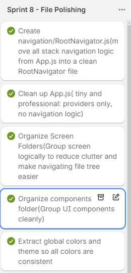
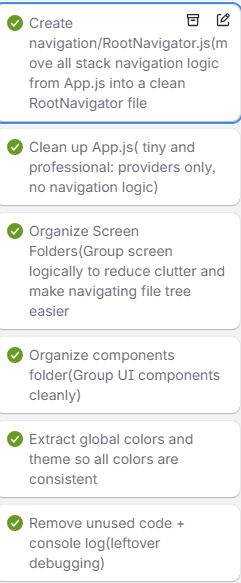

## 📅 Sprint #8 File Polish (November 25th)

### Sprint Goals

1. Remove noisy console.log statements and switch to proper console.error for backend errors.

2. Standardize error messages and HTTP status codes across all API endpoints.

3. Clean up all controller logic to follow the same structure and flow.

4. Improve validation and data integrity for Events and Community Posts.

5. Ensure role-based access control (business vs local users) works cleanly.

6. Add clear explanatory comments for maintainability and professor readability.

7. Polish all Mongoose models for safety, readability, and consistency.

---

### 🔥 Challenges + How I Solved Them

<b>Issue: RootNavigator living inside App.js </b>

<b>Fix:</b>

---

<b>Issue: Typo in AuthContext saying AuthToken instead of authToken</b>

<b>Fix: </b> Corected typo for consistency

---

<b>Issue: Had error for Post New Event in community due to mitch match of routes/navigation.navigate</b>

<b>Fix: </b> correct route mismatch for Post New Event navigation in Community

---

<b>Issue: Inconsistent error handling across controllers </b>

<b>Fix: </b> Standardized everything to: console.error

---

<b>Issue: Email case sensitivity could cause duplicate accounts</b>

<b>Fix: </b> Normalized email to lowercase in both register and login routes.

---

### 🌟 Wins + Breakthroughs

- All backend files now follow a clean, consistent, professional structure.
- Every route now has proper validation, error handling, and comments explaining the flow.
- Models are validated and include schema-level protections, enums, and virtuals.
- The codebase is now much easier to debug and maintain long-term.

### 📚 What I Learned This Week

- How to use Mongoose models effectively with enums, virtuals, and validation rules.
- The difference between frontend logging vs backend logging (only errors belong in logs for backend).
- How to design clean REST API endpoints that are easy for mobile apps to consume.
- How to build consistent API responses that make debugging easier across the entire app.

#### Photos of Progress - Sprint 8

Trello cards completed Nov 25th

Git Commit Nov 25

.png>)
.png>)

FrontEnd File Clean up Git Commit

.png>)
.png>)

BackEnd File clean up Git Commit
.png>)

Sprint 8 done Trello cards

---

## 📅 Sprint #9 Polishing (November 27)

### HubScreen.js Polish

#### Sprint Goals

1. Add Hero Section
2. Create Pill Buttons component
3. Create town modal selecter
4. Create category modal selecter
5. hook pills to existing filters
6. add date pill and logic

### Event Polish

1. Add event end time to event model
2. add fresh styling to event cards
3. Business users = "My Past Events" \*\*\*PLEASE NOTE: for development and grading purposes, I left the date handling to be able to choose a PAST date, so you can see the "My past events" feature. Otherwise I would add error handling so people couldnt post an event on a already past date.
4. Local users = Past events completely removed from Event Hub
5. Better handling on the "Date Picker" on PostEventScreen so people can choose todays date easier, and click confirm/cancel for easier handling
6. Better handling on the "Time Picker" on PostEventScreen so people can choose start and end times easier, and click confirm/cancel for easier handling
7. Edit "EditEventScreen" after making changes to PostEventScreen

### Account Polish

1. Add token key so user doesnt get logged out/memory loss when rloading the application
2. Add " Youre logged in as a business/local user"
3. Add "Hello, ${NAME}, Welcome to your summit scene hub

### Map Polish

1. Add Town, Category, Date pills like HubScreen
2. Zoom effect when choosing a town on map

### Community Polish

1. Town filter pills with a modal
2. Summary line after choosing town
3. Show an identity to the posts (Who posted)
4. Avatar?
5. Reply options

#### Photos of Progress - Sprint 9

Trello Cards for Hubscreen and Event Polish

Git commit for HubScreen and Event Polish

App ScreenShot For Town Category Date pills

App Screenshot for "Date Picker" user friendly

App Screenshot for "time picker' user friendly

MongoDB Reply array

