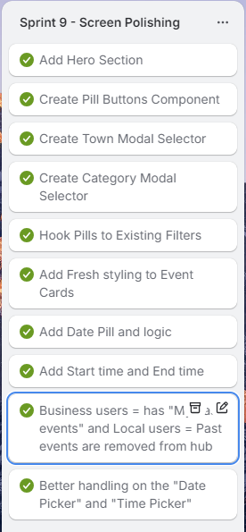
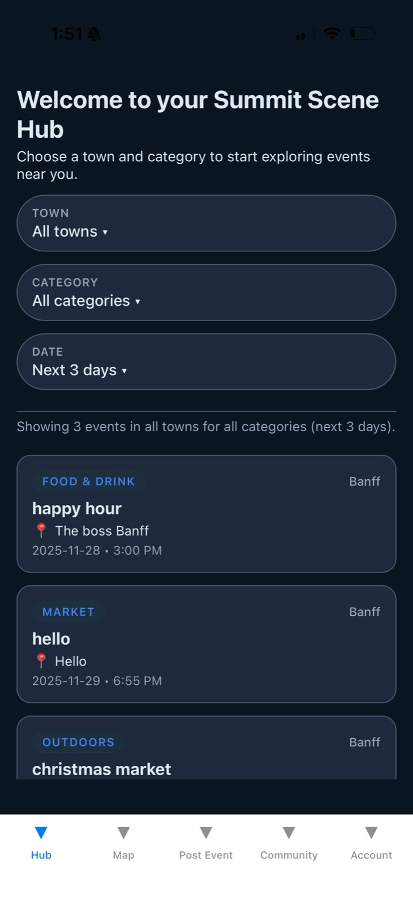
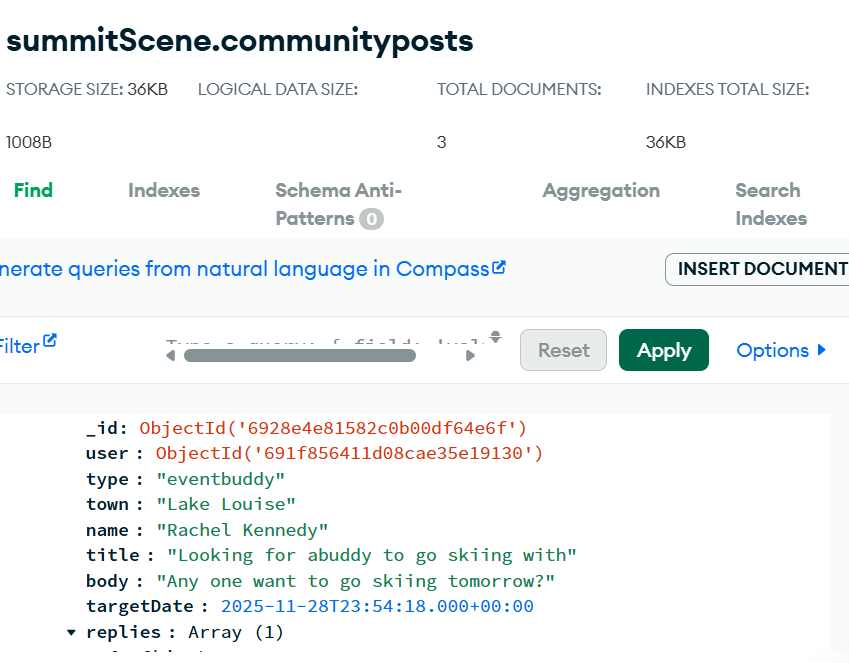
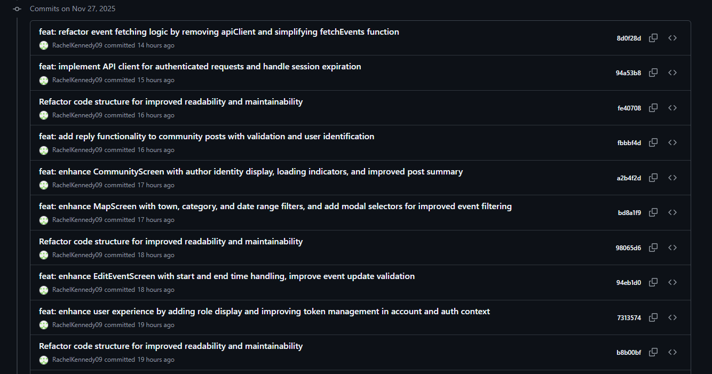

## 📅 Sprint #9 Polishing (November 27)

### HubScreen.js Polish

#### Sprint Goals

1. Add Hero Section
2. Create Pill Buttons component
3. Create town modal selecter
4. Create category modal selecter
5. hook pills to existing filters
6. add date pill and logic

### Event Polish

1. Add event end time to event model
2. add fresh styling to event cards
3. Business users = "My Past Events" \*\*\*PLEASE NOTE: for development and grading purposes, I left the date handling to be able to choose a PAST date, so you can see the "My past events" feature. Otherwise I would add error handling so people couldnt post an event on a already past date.
4. Local users = Past events completely removed from Event Hub
5. Better handling on the "Date Picker" on PostEventScreen so people can choose todays date easier, and click confirm/cancel for easier handling
6. Better handling on the "Time Picker" on PostEventScreen so people can choose start and end times easier, and click confirm/cancel for easier handling
7. Edit "EditEventScreen" after making changes to PostEventScreen

### Account Polish

1. Add token key so user doesnt get logged out/memory loss when rloading the application
2. Add " Youre logged in as a business/local user"
3. Add "Hello, ${NAME}, Welcome to your summit scene hub

### Map Polish

1. Add Town, Category, Date pills like HubScreen
2. Zoom effect when choosing a town on map

### Community Polish

1. Town filter pills with a modal
2. Summary line after choosing town
3. Show an identity to the posts (Who posted)
4. Reply options

#### Photos of Progress - Sprint 9

Trello Cards for Hubscreen and Event Polish

Git commit for HubScreen and Event Polish

App ScreenShot For Town Category Date pills

App Screenshot for "Date Picker" user friendly

App Screenshot for "time picker' user friendly

MongoDB Reply array

GitCommit Nov 27th

## Sprint 10: Local Profiles + Community Access

### 🎯 Sprint Goals

1. Add rich user profiles (avatar, town, bio, lookingFor, Instagram, website).

2. Integrate profiles into Community posts with a “View Profile” modal.
3. Allow locals and businesses to edit their profile details (new EditProfileScreen).
4. Differentiate Local vs Business profile wording (“Community Profile” vs “Event Posting Profile”).
5. Add role-based profile preview in Account screen.
6. Begin setting up user profile update route on backend (PATCH /api/users/update-profile).

---

### 🔥 Challenges + How I Solved Them

<b>Issue: Enum validation blocked real towns (e.g. "lake louise").</b> When registering, the backend refused certain valid towns because the town enum was too strict.

## <b>Fix:</b>

Relaxed validation -> changed enum to lowercase: true or broader allowed values. Registration now accepts real places like Lake Louise.

<b>Issue: : Profile information cluttered the Community cards and became overwhelming. </b> Showing town, email, lookingFor, Instagram, and business website inside each post made the cards feel busy and messy.

<b>Fix:</b> Created a clean “View Profile” modal → displays a user’s full profile in a separate focused view.
Community cards now stay clean and readable.

---

<b>Issue: Business and Local users needed different profile contexts.</b> Locals use profiles for Community, while businesses use profiles for Event Hosting — but wording was identical, causing confusion.

<b>Fix:</b> Added role-based UI copy:

Local: “Community profile — This is how your profile appears on Community posts and replies.”

Business: “Event posting profile — This is how your profile appears when you host events.”

This makes the experience personalized and professional.

---

### 🌟 Wins + Breakthroughs

- Added full role-based profiles with clean editing UX.

- Community posts now show a profile modal, not cluttered cards.

- Introduced a dedicated AccountStack for cleaner navigation architecture.

- Profile section on AccountScreen now adapts to Local vs Business.

- Registration fully supports richer fields without crashing.

- Laid foundation for changing email/password in a future sprint.

### 📚 What I Learned

- How to create role-specific UI experiences using conditional rendering.

- How to extend auth models and pass additional profile fields.

- How UX clarity significantly improves when data is separated from UI (modal vs card clutter).

---

### photos of progress Sprint 10

Issue Photo With lake lousie enum: too strict when registering

Profile building for Locals

Profile buildling for Business

